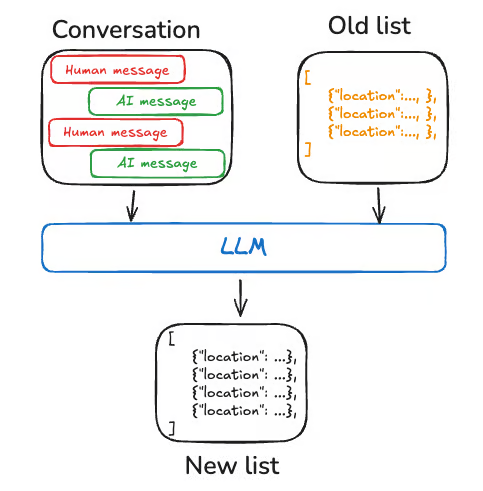
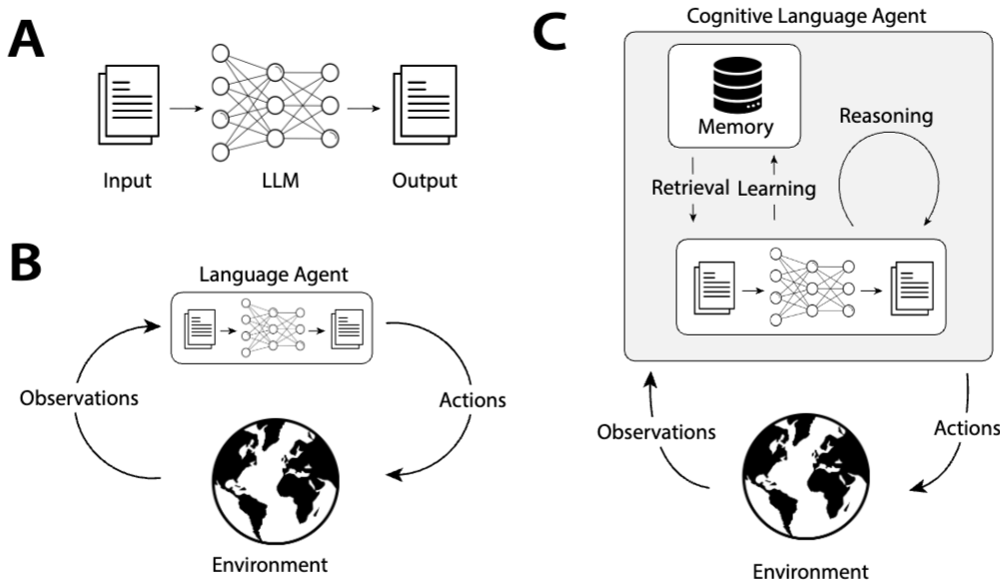
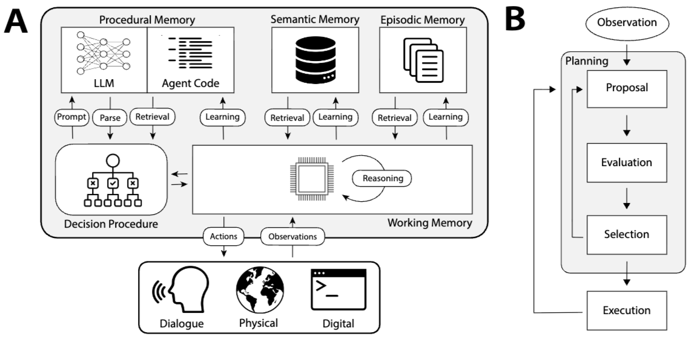

# 메모리 개요 (Memory Overview)

> 참고: https://docs.langchain.com/oss/python/concepts/memory
메모리는 이전 상호 작용에 대한 정보를 저장하는 시스템

- Short-term memory: 세션 내에서 메시지 기록을 유지하며 현재 대화 흐름을 추적
	- 체크포인트를 사용해 DB에 저장, 그래프 호출이나 단계 완료마다 단기 기억이 업데이트
- Long-term memory: 사용자 또는 애플리케이션 수준의 데이터를 세션 간에 저장, 대화 흐름 간에 공유

## 단기 기억 (Short-term memory)
애플리케이션이 단일 스레드 또는 대화 내의 이전 상호 작용을 기억할 수 있도록 합니다. 스레드는 대화 내 여러 상호 작용을 그룹화하는 방식으로 작동하며, 이는 이메일이 단일 대화 내 메시지를 그룹화하는 것과 유사합니다.

에이전트의 상태의 일부로 단기 기억을 관리하며, 스레드 기반 체크포인트를 통해 이를 보존
일반적으로 대화 기록과 같은 상태 정보, 업로드된 파일, 검색된 문서 또는 생성된 결과물 등을 포함

### 단기 기억 관리 (Manage short-term memory)
대화 기록은 일시 기억의 가장 일반적인 형태이며, 긴 대화는 오늘날의 LLM에 큰 어려움을 야기합니다. 전체 대화 기록은 LLM의 컨텍스트 창에 들어가지 않아, 회복 불가능한 오류를 발생시킬 수 있습니다. 심지어 LLM이 전체 컨텍스트 길이를 지원하더라도, 대부분의 LLM은 긴 컨텍스트에서 성능이 저하됩니다. 오래된 정보나 관련 없는 내용에 "주의"를 잃고, 더 느린 응답 시간과 높은 비용을 겪게 됩니다.

채팅 모델은 메시지를 통해 컨텍스트를 활용하며, 여기에는 개발자가 제공한 지침(시스템 메시지)과 사용자 입력(사람 메시지)이 포함됩니다. 채팅 애플리케이션에서 메시지는 사람 입력과 모델 응답이 번갈아 나타나며, 시간이 지남에 따라 메시지 목록이 길어집니다. 컨텍스트 창의 제한과 토큰 기반 메시지 목록의 비용 때문에, 많은 애플리케이션은 오래된 정보를 수동으로 제거하거나 잊는 기술을 활용하는 데 도움이 됩니다.

### 단기 기억 관리: 해결책 (Manage short-term memory)
https://docs.langchain.com/oss/python/langgraph/add-memory#manage-short-term-memory

단기 기억이 활성화되면 긴 대화가 LLM의 컨텍스트 창을 초과할 수 있습니다. 일반적인 해결책은 다음과 같습니다.
- [메시지 트리밍](https://docs.langchain.com/oss/python/langgraph/add-memory#trim-messages): LLM 호출 전에 첫 번째 또는 마지막 N개의 메시지 제거
- [메시지 삭제](https://docs.langchain.com/oss/python/langgraph/add-memory#delete-messages): LangGraph 상태에서 메시지를 영구 삭제
- [요약](https://docs.langchain.com/oss/python/langgraph/add-memory#summarize-messages): 이전 메시지를 요약하고 해당 메시지를 요약본으로 대체
- [체크포인트 관리](https://docs.langchain.com/oss/python/langgraph/add-memory#manage-checkpoints): 메시지 기록을 저장하고 검색하기 위한 체크포인트 관리
- 맞춤형 전략 (예: 메시지 필터링 등)
> **보충: 단기 기억 관리 코드와 체크포인터**
>
> - **Trim**: LLM 호출 전에 입력 메시지만 토큰 기준으로 잘라 쓴다.
> ```python
> from langchain_core.messages.utils import trim_messages, count_tokens_approximately
> messages = trim_messages(state["messages"], strategy="last",
>                          token_counter=count_tokens_approximately, max_tokens=128)
> ```
> - **Delete**: state에서 메시지를 영구 삭제한다. `RemoveMessage`를 반환한다.
> ```python
> from langchain.messages import RemoveMessage
> from langgraph.graph.message import REMOVE_ALL_MESSAGES
> return {"messages": [RemoveMessage(id=m.id) for m in messages[:2]]}  # 특정 메시지
> return {"messages": [RemoveMessage(id=REMOVE_ALL_MESSAGES)]}         # 전체
> ```
> - **Summarize**: LangMem의 `SummarizationNode`로 이전 메시지를 요약으로 대체한다.
> ```python
> from langmem.short_term import SummarizationNode
> node = SummarizationNode(token_counter=count_tokens_approximately, model=summarization_model, max_tokens=256)
> builder.add_node("summarize", node)
> ```
> - **Checkpoints**: 스레드 상태 조회와 삭제
> ```python
> config = {"configurable": {"thread_id": "1"}}
> graph.get_state(config)                   # 현재 상태
> list(graph.get_state_history(config))     # 체크포인트 이력
> checkpointer.delete_thread("1")           # 스레드의 모든 체크포인트 삭제
> ```
> - **체크포인터 선택**: `InMemorySaver`는 개발용이고, 운영에서는 `PostgresSaver` / `MongoDBSaver` / `RedisSaver`를 쓴다. DB 기반 구현은 최초 1회 `setup()`으로 스키마를 만들어야 한다.
> - **서브그래프**: checkpointer는 부모 그래프에만 넘기면 자식 서브그래프로 자동 전파된다.
>
> 출처: https://docs.langchain.com/oss/python/langgraph/add-memory


### 장기 기억 (Long-term memory)
다양한 대화나 세션에서 정보를 유지할 수 있도록 합니다. 반면, 단기 기억은 스레드 기반으로 작동하지만, 장기 기억은 사용자 정의 "네임스페이스" 내에 저장

DB 및 유사도 검색 등으로 장기 메모리 활용도 가능
https://docs.langchain.com/oss/python/langgraph/add-memory#long-term-memory-with-semantic-search

메모리에는 어떤 유형이 있을까요? 인간은 기억을 사용해 사실([의미 기억](https://docs.langchain.com/oss/python/concepts/memory#semantic-memory)), 경험([일화 기억](https://docs.langchain.com/oss/python/concepts/memory#episodic-memory)), 규칙([절차 기억](https://docs.langchain.com/oss/python/concepts/memory#procedural-memory))을 기억합니다. AI 에이전트도 같은 방식으로 기억을 쓸 수 있습니다. 예를 들어 사용자에 대한 특정 사실을 기억해 작업을 수행할 수 있습니다.

메모리는 언제 업데이트?
- 애플리케이션 로직의 일부로 업데이트 가능 
- 백그라운드
- 사용자 응답 전에 사실을 기억하도록 결정한다 
다양한 애플리케이션에는 서로 다른 종류의 메모리가 필요합니다. 완벽한 비유는 아니지만, 인간의 기억 유형을 살펴보는 것은 유용한 통찰력을 제공할 수 있습니다. 예를 들어, CoALA 연구와 같은 일부 연구에서는 이러한 인간의 기억 유형을 AI 에이전트에서 사용되는 유형과 연결하기도 했습니다.

| 메모리 유형 | 저장하는 것 | 인간의 예 | 에이전트의 예 |
|---|---|---|---|
| [의미(Semantic)](https://docs.langchain.com/oss/python/concepts/memory#semantic-memory) | 사실 | 학교에서 배운 것 | 사용자에 대한 정보 |
| [일화(Episodic)](https://docs.langchain.com/oss/python/concepts/memory#episodic-memory) | 경험 | 내가 한 일 | 에이전트의 과거 행동 |
| [절차(Procedural)](https://docs.langchain.com/oss/python/concepts/memory#procedural-memory) | 지침 | 본능 또는 운동 능력 | 에이전트 시스템 프롬프트 |

**Semantic memory**
- 인간/AI 모두 적용되는 개념, 특정 사실과 개념을 기억하는 것
- 과거 상호작용에서 얻은 사실이나 개념을 기억하여 애플리케이션을 개인화
예
- profile: 사용자의 프로필을 주기적으로 업데이트하는게 중요하다
	- 너무 커지면 오류 발생 가능성이 높아짐
- collection: 시간이 지남에 따라 지속적으로 업데이트되고 확장되는 문서의 모음일 수 있다
  
	- 각 개별 기억은 더 구체적이고 생성하기 쉬우므로, 시간이 지남에 따라 정보가 잃을 가능성이 줄어든다 -> 새로운 정보에 대한 새로운 객체를 생성하는 것은 기존 프로필과의 조정을 하는 것보다 LLM에게 용이하다 
	- 그러나, 이는 일부 복잡한 메모리 업데이트를 변경합니다. 모델은 이제 목록에 있는 기존 항목을 삭제하거나 업데이트해야 하며, 이는 어려울 수 있습니다. 또한, 일부 모델은 기본적으로 과도한 삽입을 수행하거나, 다른 모델은 과도한 업데이트를 수행할 수 있습니다. 이러한 문제를 관리하는 한 가지 방법은 Trustcall 패키지를 사용하는 것이며, LangSmith와 같은 도구를 사용하여 모델의 동작을 최적화하는 것을 고려해 볼 수 있습니다.
		- https://github.com/hinthornw/trustcall

> **보충: Trustcall**
>
> - **해결하려는 문제**: ① 깊게 중첩된 스키마를 LLM이 불안정하게 생성한다. ② 기존 객체를 갱신할 때 전체를 다시 생성하면 무관한 필드가 유실된다. ③ 새 항목 추가(insert)와 기존 항목 수정(update)이 섞이면 tool calling이 불안정하다.
> - **방식**: 전체 재생성 대신 JSON Patch(RFC 6902)로 "바뀐 부분"만 생성한다. 검증 오류가 나도 전체를 다시 만들지 않고 패치로 해당 부분만 고친다.
> - profile 방식에서 프로필이 커질수록 오류가 늘어나는 문제(위 내용)를 줄이는 용도이고, collection 방식의 insert/update 혼합에도 쓴다.
> ```python
> from trustcall import create_extractor
> extractor = create_extractor(llm, tools=[YourSchema], enable_inserts=True)
> result = extractor.invoke({
>     "messages": [{"role": "user", "content": "..."}],
>     "existing": {"YourSchema": current_data},   # 기존 값을 넘겨 변경분만 반영
> })
> ```
>
> 출처: https://github.com/hinthornw/trustcall

	- 문서 모음 작업은 또한 목록 검색으로 복잡성을 이동합니다. 현재 " `Store` "은 의미 기반 검색과 콘텐츠 기반 필터링을 모두 지원합니다.
	- 마지막으로, 여러 기억을 활용하면 모델에 완전한 맥락을 제공하는 것이 어려울 수 있습니다. 개별 기억은 특정 패턴을 따르지만, 이러한 구조는 기억 간의 전체적인 맥락이나 관계를 완전히 반영하지 못할 수 있습니다. 결과적으로, 이러한 기억을 사용하여 응답을 생성할 때, 통합된 프로필 방식에 비해 중요한 맥락 정보가 부족할 수 있습니다.

**Episodic memory**
- 과거의 사건이나 행동을 기억하는 것
-  AI 에이전트의 경우, 에피소드 기억은 특정 작업을 수행하는 방법을 기억하는 데 도움을 주는 데 자주 사용
실제적으로, 에피소드 기억은 종종 몇 개의 예시를 활용하여 수행하는 방식으로 구현됩니다. 에이전트는 과거 시퀀스에서 학습하여 작업을 정확하게 수행합니다. 때로는 "보여주기"가 "설명하기"보다 더 효과적이며, LLM은 예시를 통해 잘 학습합니다. Few-shot 학습은 입력-출력 예시를 업데이트하여 프롬프트를 통해 LLM을 "프로그래밍"하는 방식으로 활용할 수 있습니다. 다양한 최적의 방법을 사용하여 Few-shot 예시를 생성할 수 있지만, 사용자 입력에 기반하여 가장 관련성 높은 예시를 선택하는 것이 어려울 수 있습니다.

**Procedural memory**
특정 작업을 수행하는 데 사용되는 규칙을 기억하는 것
모델 가중치, 에이전트 코드, 그리고 에이전트의 프롬프트가 결합되어 에이전트의 기능을 결정합니다.

에이전트의 지침을 개선하는 효과적인 방법 중 하나는 "반성" 또는 메타 프롬프팅입니다. 이 방법은 에이전트에게 현재 지침(예: 시스템 프롬프트)과 최근 대화 또는 명시적인 사용자 피드백을 함께 제시하는 것을 포함합니다. 그런 다음, 에이전트는 이러한 정보를 기반으로 자체 지침을 개선합니다. 특히, 초기 단계에서 지침을 명확하게 정의하기 어려운 작업에서 이 방법이 유용합니다. 왜냐하면 에이전트는 상호 작용을 통해 학습하고 적응할 수 있기 때문입니다.


### 기억 쓰기 (Writing memories)
주요 방법: in the hot path / in the background

**In the hot path**
실시간으로 기억을 생성하는 것은 장점과 과제를 모두 가지고 있습니다. 긍정적인 측면으로는, 이 방식은 실시간 업데이트를 가능하게 하여, 이후 상호 작용에서 즉시 새로운 기억을 사용할 수 있도록 합니다. 또한, 사용자는 기억이 생성되고 저장될 때 알림을 받을 수 있어 투명성을 제공합니다.

그러나, 이 방법은 몇 가지 어려움도 가지고 있습니다. 에이전트가 어떤 정보를 기억해야 하는지 결정하기 위해 새로운 도구가 필요할 수 있습니다. 또한, 어떤 정보를 기억해야 하는 것에 대한 추론 과정은 에이전트의 응답 시간을 영향을 미칠 수 있습니다. 마지막으로, 에이전트는 메모리 생성과 다른 작업 사이를 번갈아 수행해야 하므로, 생성되는 메모리의 양과 품질에 영향을 미칠 수 있습니다.

**In the background**
이는 주요 애플리케이션의 지연을 제거하고, 애플리케이션 로직과 메모리 관리를 분리하며, 에이전트가 더 집중적인 작업을 수행할 수 있도록 합니다. 또한, 이 방식은 메모리 생성 시점을 유연하게 조절하여 불필요한 작업을 피할 수 있습니다.

 메모리 업데이트 빈도를 결정하는 것이 중요하며, 업데이트 빈도가 낮으면 다른 스레드가 새로운 컨텍스트를 받지 못할 수 있습니다. 메모리 생성 시점을 결정하는 것도 중요합니다. 일반적인 전략으로는 특정 시간 간격 후에 업데이트를 예약하거나, cron 스케줄을 사용하거나, 사용자 또는 애플리케이션 로직에 의해 수동으로 트리거하는 방법 등이 있습니다.

### 기억 저장 (Memory storage)

LangGraph는 JSON 형식의 문서로 장기 기억을 저장합니다. 각 기억은 사용자 또는 조직 ID와 같은 사용자 정의 " `namespace` " (폴더와 유사) 및 고유한 " `key` " (파일 이름과 유사) 아래에 구성됩니다. 네임스페이스는 종종 사용자 또는 조직 ID와 같은 정보를 더 쉽게 구성하는 데 도움이 되는 레이블을 포함합니다. 이러한 구조는 계층적인 기억 구성이 가능하게 합니다. 또한 콘텐츠 필터를 통해 네임스페이스 간 검색이 지원됩니다.

# LangGraph의 Store

> 참고: https://docs.langchain.com/oss/python/langgraph/stores
여러 스레드에서 정보를 유지하고, 사용자 선호도, 축적된 지식, 그리고 단일 대화 이후에도 유지되어야 할 사실을 저장합니다. 체크포인터와 달리, 이 기능은 각 스레드에 국한되지 않고, 모든 스레에서 접근 가능한 임의의 키-값 데이터를 저장

메모리는 `tuple` 로 네임스페이스가 지정되며, 다음 예시에서는 `(<user_id>, "memories")` 입니다. 네임스페이스는 원하는 길이로 설정될 수 있으며, 특정 사용자에게만 적용될 필요는 없습니다.

```python
user_id = "1"
namespace_for_memory = (user_id, "memories")
```

이 시스템은 체크포인터와 함께 작동합니다. 체크포인터는 위에서 설명한 대로 스레드에 상태를 저장하며, 스토어는 스레드 간의 접근을 위한 임의의 정보를 저장할 수 있도록 합니다. 다음 구성으로 그래프를 구성하십시오.

  
`Runtime` 객체를 사용하여 모든 노드에서 상점과 `user_id` 에 접근할 수 있습니다. `Runtime` 는 노드 함수에 매개변수로 추가할 때 LangGraph에 의해 자동으로 주입됩니다. 이를 사용하여 기억을 저장할 수 있습니다.

```python
from langgraph.runtime import Runtime
from dataclasses import dataclass

@dataclass
class Context:
    user_id: str

async def update_memory(state: MessagesState, runtime: Runtime[Context]):

    # Get the user id from the runtime context
    user_id = runtime.context.user_id

    # Namespace the memory
    namespace = (user_id, "memories")

    # ... Analyze conversation and create a new memory

    # Create a new memory ID
    memory_id = str(uuid.uuid4())

    # We create a new memory
    await runtime.store.aput(namespace, memory_id, {"memory": memory})
```

> **보충: Store API와 시맨틱 검색**
>
> - Store는 스레드와 무관한 key-value 저장소이고, 체크포인터는 스레드 단위 상태 저장소이다. 둘은 함께 쓴다.
> ```python
> graph = builder.compile(checkpointer=checkpointer, store=store)
> graph.stream(input, {"configurable": {"thread_id": "t1"}}, context=Context(user_id="1"))
> ```
> - **기본 API**: 반환 아이템에는 `value`, `key`, `namespace`, `created_at`, `updated_at`이 들어 있다.
> ```python
> store.put(namespace, key, {"data": value})
> store.get(namespace, key)
> store.search(namespace, limit=10, offset=0)   # 페이지네이션
> store.delete(namespace, key)
> ```
> - **namespace는 prefix로 매칭된다.** `("alice",)`로 검색하면 `("alice", "memories")`, `("alice", "preferences")` 등 하위 전체가 나온다.
> - **시맨틱 검색**: 스토어 생성 시 임베딩을 설정한다.
> ```python
> from langchain.embeddings import init_embeddings
> store = InMemoryStore(index={
>     "embed": init_embeddings("openai:text-embedding-3-small"),
>     "dims": 1536,
>     "fields": ["food_preference", "$"],   # 임베딩할 필드
> })
> store.search(namespace, query="What does user like?", limit=3)
> store.put(namespace, key, value, index=["field1"])   # 저장 시 임베딩 필드 지정
> store.put(namespace, key, value, index=False)        # 임베딩하지 않음
> ```
> - **노드에서의 읽기**: `Runtime`으로 주입된 store를 쓴다.
> ```python
> memories = await runtime.store.asearch((runtime.context.user_id, "memories"),
>                                        query=state["messages"][-1].content, limit=3)
> ```
> - **운영 저장소**: `PostgresStore`, `MongoDBStore`, `RedisStore`, `UpstashStore` 등. 모두 `BaseStore`를 상속한다. 문서에는 TTL 설정에 대한 언급이 없다.
>
> 출처: https://docs.langchain.com/oss/python/langgraph/stores , https://docs.langchain.com/oss/python/langgraph/add-memory


# 더 똑똑한 AI 에이전트 만들기: AgentCore 장기 메모리 심층 분석 (Building smarter AI agents: AgentCore long-term memory deep dive)

> 참고: https://aws.amazon.com/blogs/machine-learning/building-smarter-ai-agents-agentcore-long-term-memory-deep-dive/
사용자와의 상호작용을 기억하는 AI 에이전트를 만들려면 원본 대화를 저장하는 것 이상이 필요하다. Amazon Bedrock AgentCore의 단기 메모리가 당장의 맥락을 담는다면, 진짜 과제는 이런 상호작용을 세션을 가로지르는 지속적이고 실행 가능한 지식으로 바꾸는 것이다. 이 정보가 일회성 상호작용을 사용자와 AI 에이전트 사이의 의미 있고 지속적인 관계로 바꿔 준다. 이 글은 [Amazon Bedrock AgentCore](https://aws.amazon.com/bedrock/agentcore/) Memory의 장기 메모리 시스템이 어떻게 동작하는지 설명한다.

AgentCore Memory가 처음이라면 입문 글 [Amazon Bedrock AgentCore Memory: Building context-aware agents](https://aws.amazon.com/blogs/machine-learning/amazon-bedrock-agentcore-memory-building-context-aware-agents/)를 먼저 읽기를 권한다. 간단히 말해 AgentCore Memory는 단기 작업 메모리와 장기 지능형 메모리를 모두 제공해, 개발자가 맥락을 인지하는 AI 에이전트를 만들 수 있게 하는 완전 관리형 서비스이다.

## 지속적 메모리의 과제 (The challenge of persistent memory)

사람은 대화를 그대로 기억하지 않는다. 의미를 추출하고, 패턴을 파악하고, 시간에 걸쳐 이해를 쌓는다. AI 에이전트가 이렇게 반응하도록 가르치려면 몇 가지 어려운 문제를 풀어야 한다.

- 의미 있는 통찰과 일상적인 잡담을 구분해, 어떤 발화를 장기 저장하고 어떤 발화를 임시로만 처리할지 정해야 한다. "채식주의자예요"는 기억해야 하지만 "음, 생각 좀 해볼게"는 기억하지 않아야 한다.
- 시간에 걸쳐 관련된 정보를 알아보고, 중복이나 모순 없이 병합해야 한다. 사용자가 1월에 "갑각류 알레르기가 있다"고 했고 3월에 "새우를 못 먹는다"고 했다면, 이를 관련된 사실로 인식해 기존 지식과 통합해야 한다.
- 기억은 시간적 맥락 순서로 처리해야 한다. 시간이 지나면서 바뀌는 선호(작년에는 식당에서 매운 치킨을 좋아했지만 지금은 순한 맛을 선호)는 최신 선호를 존중하면서도 이전 맥락을 유지하도록 신중하게 다뤄야 한다.
- 메모리 저장소가 수천~수백만 건으로 커지면 관련 기억을 빠르게 찾는 것이 큰 과제가 된다. 포괄적인 기억 보존과 효율적인 검색 사이의 균형이 필요하다.

이 문제들을 풀려면 단순 저장을 넘어서는 정교한 추출, 통합, 검색 메커니즘이 필요하다. AgentCore Memory는 인간의 인지 과정을 본뜨면서도 엔터프라이즈가 요구하는 정밀도와 규모를 유지하는, 연구에 기반한 장기 메모리 파이프라인으로 이 복잡성을 다룬다.

## AgentCore 장기 메모리는 어떻게 동작하는가 (How AgentCore long-term memory works)

에이전트 애플리케이션이 대화 이벤트를 AgentCore Memory로 보내면, 원본 대화 데이터를 구조화되고 검색 가능한 지식으로 바꾸는 다단계 파이프라인이 시작된다. 각 구성요소를 살펴보자. 

### 1. 메모리 추출: 대화에서 통찰로 (Memory extraction)

새 이벤트가 단기 메모리에 저장되면 비동기 추출 프로세스가 대화 내용을 분석해 의미 있는 정보를 식별한다. 이 과정은 대규모 언어 모델(LLM)로 맥락을 이해하고 장기 메모리에 보존할 세부 정보를 추출한다. 추출 엔진은 들어온 메시지를 이전 맥락과 함께 처리해 미리 정의된 스키마의 메모리 레코드를 생성한다. 개발자는 하나 이상의 메모리 전략(strategy)을 설정해 애플리케이션에 필요한 정보 유형만 추출할 수 있다. 추출은 세 가지 내장 메모리 전략을 지원한다.

- **Semantic memory**: 사실과 지식을 추출한다. 예:

    ```
    "고객사는 시애틀, 오스틴, 보스턴에 직원 500명이 있다"
    ```

- **User preferences**: 맥락에 따라 명시적·암묵적 선호를 포착한다. 예:

    ```
    {"preference": "개발 작업에 Python을 선호", "categories": ["programming", "code-style"], "context": "사용자가 학생 수강신청 웹사이트를 만들려 함"}
    ```

- **Summary memory**: 세션 범위에서 토픽별로 대화의 진행 요약을 만들고, 핵심 정보를 구조화된 XML 형식으로 보존한다. 예:

    ```
    <topic="Material-UI TextareaAutosize inputRef 경고 수정 구현"> 한 개발자가 Material-UI에서 TextareaAutosize 컴포넌트를 'inputComponent' prop으로 OutlinedInput에 넘길 때 "Does not recognize the 'inputRef' prop" 경고가 나오는 문제의 수정을 성공적으로 구현했다. </topic>
    ```

각 전략은 타임스탬프와 함께 이벤트를 처리해 맥락의 연속성과 충돌 해결을 유지한다. 한 이벤트에서 여러 메모리를 추출할 수 있고, 각 메모리 전략은 독립적으로 동작하므로 병렬 처리가 가능하다.

### 2. 메모리 통합 (Memory consolidation)

기존 저장소에 새 메모리를 단순히 추가하는 대신, 시스템은 지능형 통합을 수행해 관련 정보를 병합하고, 충돌을 해결하고, 중복을 최소화한다. 이 통합 덕분에 새 정보가 들어와도 에이전트의 메모리는 일관되고 최신 상태로 유지된다.

통합 과정은 다음과 같다.

1. **검색(Retrieval)**: 새로 추출한 메모리마다 같은 namespace와 전략에서 의미적으로 가장 유사한 기존 메모리를 가져온다.
2. **지능형 처리(Intelligent processing)**: 새 메모리와 검색된 메모리를 통합 프롬프트와 함께 LLM에 보낸다. 이 프롬프트는 의미적 맥락을 보존해 불필요한 갱신을 피한다("pizza를 아주 좋아한다"와 "pizza를 좋아한다"는 본질적으로 같은 정보로 본다). 이 핵심 원칙을 지키면서 다양한 시나리오를 처리하도록 설계되어 있다. 프롬프트의 골자는 다음과 같다.

    ```
    당신은 데이터 관리 전문가입니다. 당신의 일은 메모리 저장소를 관리하는 것입니다.
    새 입력이 들어올 때마다 어떤 작업을 수행할지 결정하세요.

    새 입력 텍스트입니다.
    TEXT: {query}

    관련된 기존 메모리입니다.
    MEMORY: {memory}

    여러 도구를 호출해 메모리 저장소를 관리할 수 있습니다...
    ```

    이 프롬프트를 바탕으로 LLM이 적절한 행동을 결정한다.

    - **ADD**: 새 정보가 기존 메모리와 구별될 때
    - **UPDATE**: 새 지식이 기존 메모리를 보완하거나 갱신할 때 기존 메모리를 보강
    - **NO-OP**: 정보가 중복일 때
3. **벡터 스토어 갱신(Vector store updates)**: 결정된 행동을 적용한다. 오래된 메모리를 즉시 삭제하는 대신 INVALID로 표시해 변경 불가능한 감사 이력(immutable audit trail)을 유지한다.

이 방식은 모순된 정보를 해결하고(최신 정보 우선), 중복을 최소화하며, 관련된 메모리를 적절히 병합한다.

### 엣지 케이스 처리 (Handling edge cases)

통합 과정은 까다로운 상황도 무리 없이 처리한다.

- **순서가 뒤바뀐 이벤트**: 세션 내에서는 시간 순서대로 처리하지만, 타임스탬프를 꼼꼼히 추적하고 통합 로직을 적용해 늦게 도착한 이벤트도 처리한다.
- **상충하는 정보**: 새 정보가 기존 메모리와 모순되면 최신성을 우선하되 이전 상태의 기록은 유지한다.

    ```
    기존: "고객 예산은 $500"
    신규: "고객이 예산이 $750으로 늘었다고 말함"
    결과: $750을 담은 새 활성 메모리 생성, 이전 메모리는 비활성으로 표시
    ```

- **메모리 실패**: 한 메모리의 통합이 실패해도 다른 메모리에는 영향이 없다. 일시적 실패에는 지수 백오프와 재시도를 쓴다. 최종적으로 통합에 실패하면 정보 유실을 막기 위해 해당 메모리를 시스템에 그대로 추가한다.

## 고급 커스텀 메모리 전략 설정 (Advanced custom memory strategy configurations)

내장 전략이 일반적인 사례를 다루지만, 도메인마다 메모리 추출·통합 방식은 달라야 한다. 시스템은 [내장 전략의 override](https://docs.aws.amazon.com/bedrock-agentcore/latest/devguide/memory-custom-strategy.html)를 지원한다. 커스텀 프롬프트로 내장 추출·통합 로직을 확장해, 팀이 자기 요구에 맞게 메모리 처리를 조정할 수 있다. 시스템 호환성을 유지하고 출력 형식보다 기준과 로직에 집중하도록, 커스텀 프롬프트로 어떤 정보를 추출·필터링할지, 메모리를 어떻게 통합할지, 상충하는 정보를 어떻게 해결할지를 정한다.

추출과 통합에 쓸 모델을 직접 고르는 것도 지원해, 정확도와 지연의 균형을 필요에 맞게 조절할 수 있다. memory resource를 만들 때 API로 strategy override에 정의하거나 콘솔에서 설정한다(아래 콘솔 스크린샷 참고).


override 외에 [self-managed 전략](https://docs.aws.amazon.com/bedrock-agentcore/latest/devguide/memory-self-managed-strategies.html)도 제공한다. 메모리 처리 파이프라인을 완전히 제어하는 방식으로, 어떤 모델과 프롬프트로든 추출·통합 알고리즘을 직접 구현하면서 저장과 검색에는 AgentCore Memory를 활용한다. Batch API로 직접 추출한 레코드를 AgentCore Memory에 적재하면서 처리 로직의 소유권을 유지할 수도 있다.

### 성능 특성 (Performance characteristics)

장기 대화 메모리의 여러 측면을 평가하기 위해 공개 벤치마크 데이터셋에서 내장 메모리 전략을 평가했다.

- **LoCoMo**: 페르소나 기반 상호작용과 시간 이벤트 그래프로, 기계-인간 파이프라인이 생성한 다중 세션 대화. 현실적인 대화 패턴에서의 장기 기억 능력을 테스트한다.
- **LongMemEval**: 여러 세션과 긴 기간에 걸친 긴 대화에서 기억이 유지되는지 평가한다. 평가 효율을 위해 QA 쌍 200개를 무작위로 뽑았다.
- **PrefEval**: 20개 주제, 21개 세션 인스턴스로, 시간이 지나도 사용자 선호를 기억하고 일관되게 적용하는 능력을 테스트한다.
- **PolyBench-QA**: PolyBench의 과제를 푸는 코딩 에이전트의 80개 trajectory에서 수집한 807개 질의응답(QA) 쌍.

두 가지 표준 지표를 사용한다. **정확도(correctness)**와 **압축률(compression rate)**이다. LLM으로 판정하는 정확도는 필요할 때 저장된 정보를 제대로 회상하고 활용하는지를 평가한다. 압축률은 출력 메모리 토큰 수 / 전체 컨텍스트 토큰 수로 정의하며, 메모리 시스템이 정보를 얼마나 효과적으로 저장하는지를 평가한다. 압축률이 높다는 것은 핵심 정보를 유지하면서 저장 오버헤드를 줄인다는 뜻이다. 이는 곧 추론 속도 향상과 토큰 소비 감소로 이어진다. 대규모 에이전트 운영에서 가장 중요한 고려사항인데, 방대한 대화 이력을 더 효율적으로 처리하고 운영 비용을 줄여 주기 때문이다.

| 메모리 유형 | 데이터셋 | 정확도 | 압축률 |
|---|---|---|---|
| RAG baseline (전체 대화 이력) | LoCoMo | 77.73% | 0% |
| RAG baseline (전체 대화 이력) | LongMemEval-S | 75.2% | 0% |
| RAG baseline (전체 대화 이력) | PrefEval | 51% | 0% |
| Semantic Memory | LoCoMo | 70.58% | 89% |
| Semantic Memory | LongMemEval-S | 73.60% | 94% |
| Preference Memory | PrefEval | 79% | 68% |
| Summarization | PolyBench-QA | 83.02% | 95% |

RAG(검색 증강 생성) baseline은 전체 대화 이력에 접근할 수 있어 사실형 QA에서는 잘하지만 선호 추론에는 약하다. 메모리 시스템은 실용적인 절충을 이룬다. 정보를 압축하므로 일부 사실형 과제에서는 정확도가 약간 낮지만, 89~95%의 압축률로 확장 가능한 배포와 제한된 컨텍스트 크기를 유지하고, 각자의 특화된 용도에서 효과적으로 동작한다.

선호나 행동 패턴 이해처럼 추론이 필요한 복잡한 과제에서는 메모리가 정확도와 저장 효율 양쪽에서 분명한 우위를 보인다. 이런 용도에서는 추출한 통찰이 원본 대화 데이터보다 더 가치 있기 때문이다.

정확도 지표 외에도 AgentCore Memory는 운영 배포에 필요한 성능 특성을 제공한다.

- 추출 트리거 후 일반적인 대화의 추출·통합 작업은 20~40초 안에 완료된다.
- 시맨틱 검색(`retrieve_memory_records` API)은 약 200밀리초에 결과를 반환한다.
- 병렬 처리 아키텍처로 여러 메모리 전략이 독립적으로 처리되므로, 서로 다른 유형의 메모리를 서로 막지 않고 동시에 처리할 수 있다.

이런 지연 특성과 높은 압축률 덕분에, 대규모 배포에서도 응답성 있는 사용자 경험을 유지하면서 방대한 대화 이력을 효율적으로 관리할 수 있다.

## 장기 메모리 모범 사례 (Best practices for long-term memory)

에이전트에서 장기 메모리의 효과를 극대화하려면 다음을 따른다.

- **적합한 메모리 전략 선택**: 용도에 맞는 내장 전략을 고르거나, 도메인 특화 요구에는 커스텀 전략을 만든다. Semantic은 사실 지식을, Preference는 개인 선호 맞춤을, Summarization은 복잡한 정보를 요약해 맥락 관리를 돕는다. 예를 들어 고객 지원 에이전트는 semantic으로 고객 거래 이력과 과거 이슈를 기록하고, summarization으로 현재 지원 대화와 토픽별 문제 해결 흐름을 짧은 서사로 만든다.
- **의미 있는 namespace 설계**: 애플리케이션의 계층을 반영해 namespace를 구성한다. 메모리를 정밀하게 격리하고 효율적으로 검색하는 데도 도움이 된다. 예를 들어 개별 에이전트 메모리에는 `customer-support/user/john-doe`, 팀 전체 정보에는 `customer-support/shared/product-knowledge`를 쓴다.
- **통합 패턴 모니터링**: 어떤 메모리가 생성·갱신·스킵되는지 `list_memories`나 `retrieve_memory_records` API로 정기적으로 점검한다. 추출 전략을 다듬고, 용도에 더 잘 맞는 정보를 시스템이 포착하게 하는 데 도움이 된다.
- **비동기 처리에 대비**: 장기 메모리 추출은 비동기이다. 이벤트 수집과 메모리 사용 가능 시점 사이의 지연을 처리하도록 애플리케이션을 설계한다. 장기 메모리가 백그라운드에서 처리·통합되는 동안 즉시 필요한 검색은 단기 메모리로 보완한다. 처리 지연 동안 사용자 기대를 관리하도록 폴백 메커니즘이나 로딩 상태를 두는 것도 고려한다.

## 결론 (Conclusion)

Amazon Bedrock AgentCore Memory의 장기 메모리 시스템은 AI 에이전트 구축에서 의미 있는 진전이다. 정교한 추출 알고리즘, 지능형 통합 프로세스, 변경 불가능한 저장 설계를 결합해, 학습하고 적응하고 개선하는 에이전트의 견고한 기반을 제공한다.

연구에 기반한 프롬프트부터 혁신적인 통합 워크플로우까지 이 시스템의 원리는 에이전트가 단지 기억하는 데 그치지 않고 이해하게 한다. 이는 일회성 상호작용을 지속적인 학습 경험으로 바꿔, 대화할수록 더 도움이 되고 개인화되는 AI 에이전트를 만든다.

참고 자료
- [AgentCore Memory 문서](https://docs.aws.amazon.com/bedrock-agentcore/latest/devguide/memory.html)
- [AgentCore Memory 코드 샘플](https://github.com/awslabs/amazon-bedrock-agentcore-samples/tree/main/01-tutorials/04-AgentCore-memory/)
- [AgentCore 시작하기 워크숍](https://catalog.us-east-1.prod.workshops.aws/workshops/850fcd5c-fd1f-48d7-932c-ad9babede979/en-US)


# LangMem

> 참고: https://langchain-ai.github.io/langmem/
LangMem은 에이전트가 시간이 지남에 따라 상호 작용을 통해 학습하고 적응하도록 돕습니다.

- 대화에서 중요한 정보를 추출하고, 프롬프트를 다듬어 에이전트의 행동을 최적화하고, 장기 기억을 유지하는 데 필요한 도구를 제공합니다.
- 어떤 저장 시스템에서도 쓸 수 있는 함수형 기본 요소(primitive)와, LangGraph 저장 레이어와의 네이티브 통합을 모두 제공합니다.
- 이를 통해 에이전트는 지속적으로 개선되고, 응답을 개인화하며, 세션 간에 일관된 동작을 유지할 수 있습니다.

장기 기억 기능은 대화 내에서 중요한 정보를 기억할 수 있도록 합니다. LangMem은 대화에서 의미 있는 정보를 추출하고, 저장하고, 이를 활용하여 향후 상호 작용을 개선하는 방법을 제공합니다. LangMem의 핵심은 각 기억 연산이 동일한 패턴을 따르는 것입니다.

1. 대화 내용과 현재 메모리 상태를 입력받는다
2. LLM에게 메모리 상태를 어떻게 확장하거나 통합할지 묻는다
3. 업데이트된 메모리 상태를 응답한다

가장 효과적인 기억 시스템은 대개 애플리케이션에 특화되어 있습니다. 시스템을 설계할 때 다음 질문이 도움이 됩니다.

1. **무엇을**: 에이전트가 어떤 [유형의 콘텐츠](https://langchain-ai.github.io/langmem/concepts/conceptual_guide/#memory-types)를 학습해야 할까요? 사실/지식? 과거 사건 요약? 규칙과 스타일?
2. **언제**: 언제 [기억을 형성](https://langchain-ai.github.io/langmem/concepts/conceptual_guide/#writing-memories)해야 할까요? (그리고 **누가** 기억을 형성해야 할까요?)
3. **어디에**: 기억을 [어디에 저장](https://langchain-ai.github.io/langmem/concepts/conceptual_guide/#storage-system)해야 할까요? (프롬프트? 시맨틱 저장소?) 이것이 기억을 어떻게 회상할지를 크게 좌우합니다.

### 메모리 유형 (Type of Memory)

| 메모리 유형 | 목적 | 에이전트 예시 | 인간 예시 | 일반적인 저장 방식 |
|---|---|---|---|---|
| 의미(Semantic) | 사실과 지식 | 사용자 선호도, 지식 트리플 | 파이썬이 프로그래밍 언어라는 것을 아는 것 | 프로필 또는 컬렉션 |
| 일화(Episodic) | 과거 경험 | few-shot 예시, 이전 대화 요약 | 첫 출근 날을 기억하는 것 | 컬렉션 |
| 절차(Procedural) | 시스템 동작 | 핵심 성격과 응답 패턴 | 자전거 타는 법을 아는 것 | 프롬프트 규칙 또는 컬렉션 |

컬렉션은 대부분의 사람이 "에이전트의 장기 기억"이라고 떠올리는 방식입니다. 이 방식에서는 기억이 개별 문서나 레코드로 저장되며, 새 대화마다 메모리 시스템이 저장소에 새 기억을 추가할지 결정할 수 있습니다.

## 기억 쓰기 (Writing memories)

기억은 두 가지 방식으로 형성할 수 있으며 각각 쓰임이 다릅니다. 첫 번째는 대화 중에 일어나며, 중요한 맥락이 나타날 때 즉시 업데이트할 수 있습니다. 두 번째는 상호 작용이 끝난 뒤에 일어나며, 응답 시간에 영향을 주지 않고 더 깊은 패턴 분석을 할 수 있습니다. 이 두 방식을 함께 쓰면 빠른 반응성과 깊이 있는 학습을 모두 얻을 수 있습니다.

| 형성 방식 | 지연 영향 | 업데이트 속도 | 처리 부하 | 사용 사례 |
|---|---|---|---|---|
| 활성(Active) | 더 높음 | 즉시 | 응답 중 | 중요한 맥락 업데이트 |
| 백그라운드(Background) | 없음 | 지연 | 호출 사이/이후 | 패턴 분석, 요약 |

### 유연한 검색 (Flexible Retrieval)

관리형 API를 쓰면 LangMem은 LangGraph의 [BaseStore](https://langchain-ai.github.io/langgraph/reference/store/#langgraph.store.base.BaseStore) 인터페이스와 직접 통합되어 기억을 저장하고 검색합니다. 이 저장 시스템은 여러 방식의 검색을 지원합니다.

- [**직접 접근(Direct Access)**](https://langchain-ai.github.io/langgraph/reference/store/#langgraph.store.base.BaseStore.get): 키로 특정 기억 가져오기
- [**의미 기반 검색(Semantic Search)**](https://langchain-ai.github.io/langgraph/reference/store/#langgraph.store.base.BaseStore.search): 의미적 유사도로 기억 찾기
- [**메타데이터 필터링(Metadata Filtering)**](https://langchain-ai.github.io/langgraph/reference/store/#langgraph.store.base.BaseStore.search): 속성으로 기억 필터링

> **보충: LangMem API와 개념**
>
> - **API 진입점**
>   - `create_memory_manager`: 대화에서 메모리를 추출·갱신·통합한다. 저장소에 의존하지 않는 함수형 primitive이다. `enable_inserts=False`면 새 항목 추가 없이 기존 항목(profile) 갱신만 한다.
>   - `create_memory_store_manager`: 추출한 메모리를 저장소에 영속화한다.
>   - `create_manage_memory_tool`: 에이전트가 메모리 생성·갱신·삭제를 직접 수행하는 도구이다.
>   - `create_prompt_optimizer`: 대화와 피드백으로 시스템 프롬프트를 개선한다(procedural memory).
>   - 그 외 시맨틱 검색 도구와 멀티 프롬프트 최적화 도구가 있다.
> ```python
> manager = create_memory_manager(
>     "anthropic:claude-3-5-sonnet-latest",
>     instructions="Extract user preferences and settings",
>     enable_inserts=False,
> )
> ```
> - **semantic memory 두 가지 구현**: collection은 문서를 무한정 쌓고 런타임에 검색하며 새 정보와 기존 믿음을 삭제·통합으로 조정해야 한다. profile은 현재 상태를 담은 단일 문서이고 갱신하면 내용을 대체한다.
> - **episodic memory**: 성공한 상호작용을 학습 예시로 보존한다. 상황 맥락, 추론 과정, 성공 요인을 함께 담는다.
> - **procedural memory**: 시스템 프롬프트에서 시작해 피드백으로 최적화하며 발전한다.
> - **namespace**: 조직 → 사용자 → 컨텍스트처럼 계층으로 구성하고, `{user_id}` 같은 템플릿 변수를 런타임에 채운다.
>
> 출처: https://langchain-ai.github.io/langmem/concepts/conceptual_guide/


# 언어 에이전트를 위한 인지 아키텍처 (Cognitive Architectures for Language Agents, CoALA)

> 참고: https://arxiv.org/abs/2309.02427
## 배경: 생성 시스템과 인지 아키텍처

LLM 기반 에이전트 연구가 늘어나면서 이를 체계화할 개념적 틀이 필요해졌다. 이 논문은 컴퓨팅과 AI 역사의 두 가지 아이디어와의 유사점에서 출발한다.

- **생성 시스템(production systems)**: 규칙을 반복 적용해 일련의 결과를 만들어 내는 시스템이다(Newell and Simon, 1972). LLM이 푸는 문제와 비슷한 문자열 조작 시스템으로 시작했고, 이후 AI 커뮤니티가 복잡하고 계층적으로 구조화된 행동을 수행하는 시스템을 정의하는 데 채택했다(Newell et al., 1989).
- **인지 아키텍처(cognitive architectures)**: 그런 구성요소를 모듈로 조직하는 틀이다.



## CoALA 개요

CoALA는 범용 언어 에이전트를 특성화하고 설계하기 위한 개념적 프레임워크이다. 에이전트를 세 가지 핵심 차원으로 구성한다.

| 차원 | 구성 |
|---|---|
| 정보 저장소(기억) | 작업 기억과 장기 기억으로 구분 |
| 행동 공간 | 내부 행동과 외부 행동으로 구분 |
| 의사결정 절차 | 계획과 실행을 포함하는 상호작용 루프 |

- 기억, 행동, 의사결정이라는 세 개념으로 기존의 많은 에이전트를 깔끔하게 표현할 수 있고, 새 에이전트를 개발할 미개척 방향도 찾을 수 있다.
- CoALA는 LLM을 더 큰 인지 아키텍처의 핵심 구성요소로 둔다(그림 4).
- 언어 에이전트는 정보를 기억 모듈에 저장하고, 외부와 내부로 구조화된 행동 공간에서 작동한다(그림 5).



### 행동 공간

- **외부 행동**: 그라운딩(grounding)을 통해 외부 환경(로봇 제어, 인간과의 의사소통, 웹사이트 탐색 등)과 상호 작용한다.
- **내부 행동**: 내부 기억과 상호 작용한다. 어떤 기억에 접근하는지, 읽기인지 쓰기인지에 따라 세 가지로 나뉜다.
  - **검색(retrieval)**: 장기 기억에서 읽기 (4.3)
  - **추론(reasoning)**: LLM으로 단기 작업 기억 갱신 (4.4)
  - **학습(learning)**: 장기 기억에 쓰기 (4.5)

### 의사결정 주기

- 언어 에이전트는 반복되는 주기를 따라 행동을 선택한다(4.6, 그림 4B).
- 각 주기에서 계획을 세우려고 추론과 검색 행동을 쓸 수 있다. 이 계획 하위 프로세스가 외부 세계나 장기 기억에 영향을 주는 접지 행동 또는 학습 행동을 고른다.
- 결정 주기는 프로그램의 "main" 절차(반환 값이 없는 메서드)와 비슷하다.

## 4.1 메모리 (Memory)

언어 모델은 상태가 없다(stateless). 호출 사이에 정보를 유지하지 않는다. 반면 언어 에이전트는 세계와 다단계로 상호작용하기 위해 정보를 내부에 저장하고 유지할 수 있다. CoALA에서 에이전트는 정보(주로 텍스트이지만 다른 양식도 가능)를 여러 메모리 모듈로 명시적으로 구성하며, 각 모듈은 서로 다른 형태의 정보를 담는다. 단기 작업 기억 하나와 장기 기억 셋(일화, 의미, 절차)이 있다.

| 메모리 | 저장하는 것 | 특징 |
|---|---|---|
| **작업 기억**(working) | 현재 의사결정 주기에서 활성 상태인, 즉시 쓸 수 있는 정보. 지각 입력, 활성 지식(추론으로 생성했거나 장기 기억에서 검색), 이전 주기에서 이월된 핵심 정보(예: 활성 목표) | LLM 호출 전반에 걸쳐 지속되는 데이터 구조이다. 장기 기억 및 grounding 인터페이스와 상호작용하는 중앙 허브이다. |
| **일화 기억**(episodic) | 이전 의사결정 주기의 경험. 학습용 입출력 쌍, 이력 이벤트 흐름, 이전 에피소드의 게임 궤적 등 | 계획 단계에서 작업 기억으로 검색해 추론을 돕는다. 새 경험을 작업 기억에서 일화 기억으로 기록하는 것이 학습의 한 형태이다. |
| **의미 기억**(semantic) | 세계와 에이전트 자신에 대한 지식 | 전통적인 NLP/RL 접근은 외부 DB로 읽기 전용 의미 기억을 초기화한다. 언어 에이전트는 LLM 추론으로 얻은 새 지식을 써서 경험으로 세계 지식을 쌓을 수 있다. |
| **절차 기억**(procedural) | LLM 가중치(암묵적 지식)와 에이전트 코드(명시적 지식) | 에이전트 코드는 행동을 구현하는 절차(추론, 검색, 접지, 학습)와 의사결정 자체를 구현하는 절차로 나뉜다. |

- **작업 기억**: 기존 방법은 LLM이 중간 추론을 생성하게 하고 LLM 자체의 컨텍스트를 작업 기억처럼 쓴다. CoALA의 작업 기억은 더 일반적이다. LLM을 호출할 때 입력은 작업 기억의 일부(프롬프트 템플릿과 관련 변수)에서 합성하고, LLM 출력은 다른 변수(행동 이름, 인자)로 다시 파싱해 작업 기억에 저장한 뒤 그 행동을 실행하는 데 쓴다(그림 3A).
- **절차 기억**: 처음에 비어 있거나 존재하지 않을 수 있는 일화·의미 기억과 달리, 절차 기억은 에이전트를 부트스트랩하도록 설계자가 적절한 코드로 초기화해야 한다. 절차 기억에 써서 새 행동을 학습하는 것도 가능하지만, 버그를 쉽게 만들거나 에이전트가 설계자의 의도를 훼손할 수 있어 일화·의미 기억에 쓰는 것보다 훨씬 위험하다.

## 4.2 접지 행동 (Grounding actions)

접지 절차는 외부 행동을 실행하고 환경 피드백을 텍스트로 작업 기억에 처리한다. 에이전트와 외부 세계의 상호작용을 텍스트 관찰과 행동이 있는 "텍스트 게임"으로 단순화한 것이다. 외부 환경은 세 종류로 나눈다.

- **물리적 환경**: AI 에이전트를 위해 가장 오래전에 구상된 구현 형태이다. 지각 입력(시각, 청각, 촉각)을 텍스트 관찰로 바꾸고(예: 사전 학습된 캡셔닝 모델), 언어 기반 명령을 따르는 로봇 플래너로 물리 환경에 영향을 준다. LLM을 로봇의 "두뇌"로 쓰는 로봇 프로젝트가 많이 등장했고, 지각 입력에는 비전-언어 모델로 이미지를 텍스트로 변환해 LLM에 추가 맥락을 준다.
- **인간 또는 다른 에이전트와의 대화**: 고전적인 언어 상호작용으로 지시를 받거나 사람에게 배울 수 있다. 언어 생성이 가능한 에이전트는 도움이나 명확한 설명을 요청하고, 사람을 즐겁게 하거나 정서적으로 도울 수 있다. 사회적 시뮬레이션, 토론, 안전성 향상, 협력적 작업 해결을 위한 다중 언어 에이전트 간 상호작용 연구도 있다.
- **디지털 환경**: 게임, API, 웹사이트와의 상호작용과 일반적인 코드 실행을 포함한다. 물리적 또는 인간 상호작용보다 저렴하고 빨라서 언어 에이전트의 편리한 테스트베드이며, 최근 점점 더 집중적으로 연구된다. 특히 외부 지식이나 계산이 필요한 NLP 작업에서는 상태 비저장 디지털 API(검색, 계산기, 번역기)가 "도구(tools)"로 패키징되는 경우가 많고, 이는 특별한 "일회용" 디지털 환경으로 볼 수 있다.

## 4.3 검색 행동 (Retrieval actions)

장기 기억에서 작업 기억으로 정보를 읽어 오는 행동이다. 구현 방식은 규칙 기반, sparse(BM25 등), dense(임베딩) 검색이 있다.

| 사례 | 검색 대상 | 방식 |
|---|---|---|
| Generative Agents | 일화 기억의 관련 이벤트 | 최신성(규칙 기반), 중요도(추론 기반), 관련성(임베딩 기반) 점수를 조합 |
| DocPrompting | 라이브러리 문서(의미 기억에서 지식 검색에 해당) | 코드 생성을 돕기 위해 문서를 검색 |
| Voyager | 절차 기억(계층적 코드 스킬 라이브러리) | dense 검색으로 접지 절차를 불러옴 |

검색은 인간의 의사결정에서 핵심적인 역할을 하지만, 언어 에이전트에서 적응적이고 맥락에 특화된 회상(recall)은 아직 충분히 연구되지 않았다. 의사결정과 검색의 원칙적인 통합이 중요한 향후 연구 방향이다.

## 4.4 추론 행동 (Reasoning actions)

추론은 작업 기억의 내용을 처리해 새 정보를 만든다. 검색이 장기 기억에서 작업 기억으로 읽어 오는 것인 반면, 추론은 작업 기억을 읽고 쓴다. 에이전트는 가장 최근의 관찰, 가장 최근의 궤적(Reflexion), 장기 기억에서 검색한 정보(Generative Agents)에 대한 통찰을 요약하고 추출할 수 있다. 추론은 학습(결과를 장기 기억에 기록)이나 의사결정(결과를 이후 LLM 호출의 추가 맥락으로 사용)을 돕는 데 쓴다.

## 4.5 학습 행동 (Learning actions)

학습은 장기 기억에 정보를 기록하는 것이며, 여러 절차가 있다.

| 대상 | 내용 | 예 |
|---|---|---|
| **일화 기억** | 경험을 기록한다. 이후 추론과 의사결정의 예시와 근거로 검색한다. RL 에이전트가 에피소드 궤적을 저장하는 것은 일반적인 관행이다. | - |
| **의미 기억** | LLM으로 원시 경험을 추론하고 그 결과를 지식으로 저장한다. | Reflexion: 실패한 에피소드를 성찰해 "부엌에 식기세척기가 없음" 같은 지식으로 저장하고, 이후 에피소드의 LLM 맥락에 붙인다. 로봇 분야에서는 비전-언어 모델로 환경의 의미 지도를 만들어 나중에 명령 실행 시 질의한다. |
| **LLM 파라미터** (절차 기억) | LLM 가중치는 암묵적 절차 지식이다. 파인튜닝으로 에이전트의 도메인에 맞출 수 있다. 방식은 지도 학습·모방 학습, 환경 피드백 RL, 인간 피드백(RLHF), AI 피드백이 있다. 고전적인 LLM 자기 개선은 일관성 같은 외부 지표로 파인튜닝할 생성물을 고른다. | XTX: 일화 기억에 저장된 고득점 궤적으로 소형 언어 모델을 주기적으로 파인튜닝한다(탐색 경계에 도달하기 위한 강력한 "활용" 정책 역할). |
| **에이전트 코드** (절차 기억) | 에이전트가 자신의 소스 코드를 수정해 절차 구현을 바꾼다. 아래에 세분화한다. | - |

LLM 파인튜닝은 비용이 큰 학습이라 현재 연구들은 학습 일정을 미리 정한다. 학습이 더 효율적이 되거나 에이전트가 더 작은 하위 작업 특화 LLM을 쓰게 되면, 에이전트가 스스로 언제 어떻게 파인튜닝할지 결정하는 것도 가능해질 수 있다.

**에이전트 코드 업데이트의 세분화**

- **추론 업데이트**(프롬프트 템플릿): 예를 들어 APE는 입출력 예시에서 프롬프트 지침을 추론해 LLM 프롬프트의 일부로 쓴다. 이런 프롬프트 업데이트는 추론을 학습하는 한 형태이다.
- **접지 업데이트**(코드 기반 스킬): 예를 들어 Voyager는 커리큘럼 라이브러리를 유지한다. 다만 현재 방법은 외부 환경과 상호작용하는 새 코드 스킬을 만드는 데 국한된다.
- **검색 업데이트**: 아는 한 최근 언어 에이전트에서 연구되지 않았다. 검색은 보통 BM25나 dense 같은 고정 구현의 기본 작업으로 보지만, 쿼리/문서 확장이나 검색 증류 연구가 언어 에이전트가 더 나은 검색 절차를 학습하는 데 도움이 될 수 있다.
- **학습 또는 의사결정 업데이트**: 학습이나 의사결정을 위한 새 절차를 학습하는 것은 이론적으로 가능하다. 하지만 이런 업데이트는 에이전트의 기능과 정렬(alignment) 모두에 위험하다. 현재 이런 형태의 학습을 구현한 언어 에이전트는 없는 것으로 알고 있다.

**학습 방식의 특징과 남은 과제**

- RL 에이전트는 보통 한 가지 학습 방식(Q-learning, PPO, A3C 등)을 고정하고 모델 파라미터를 갱신한다. 언어 에이전트는 여러 학습 절차 중에서 고를 수 있다. 작업 관련 언어를 저장하는 방식은 파라미터 업데이트보다 싸고 빨라서 빠르게 학습할 수 있고, 여러 형태의 학습을 함께 써서 자기 개선을 강화할 수 있다(예: Generative Agents).
- 지금까지의 논의는 메모리에 추가하는 것 위주였다. 수정과 삭제("망각(unlearning)")는 최근 언어 에이전트에서 충분히 연구되지 않았다.

## 4.6 의사결정 (Decision making)

행동 공간에 접지, 학습, 추론, 검색이 모두 있을 때 어떤 행동을 적용할지는 최상위 "main" 에이전트 프로그램인 **의사결정 절차**가 정한다. CoALA는 이를 의사결정 주기로 구조화해 외부 접지 행동 또는 내부 학습 행동을 만들어 낸다. 각 주기는 **계획 단계**와 **실행 단계**로 이루어진다.

### 계획 단계

계획 중에는 추론과 검색을 유연하게 적용해 행동을 제안, 평가, 선택한다. 이 하위 단계들을 서로 끼워 넣거나 반복해 외부 행동을 취하기 전에 다단계 시뮬레이션을 만들 수도 있다. 후보 해결책을 반복해 개선하는 것도 가능하다. 예를 들어 LLM으로 시뮬레이션하고, 결함을 찾고, 그 결함을 고치는 수정을 제안한다.

| 하위 단계 | 내용 |
|---|---|
| **제안**(proposal) | 하나 이상의 행동 후보를 만든다. 일반적으로 추론(선택적으로 검색)으로 LLM에서 하나 또는 여러 접지 행동을 샘플링한다. 행동이 제한된 단순한 도메인에서는 모든 행동을 후보로 포함한다(SayCan). 더 정교한 에이전트는 if-else 또는 while-if 코드 구조를 쓰고(Voyager, Generative Agents), 잘 정의된 도메인에서는 구조화된 시뮬레이터로 그럴듯한 롤아웃을 만든다. |
| **평가**(evaluation) | 후보가 여럿이면 각각에 값을 매긴다. 휴리스틱 규칙, LLM(퍼플렉시티) 값(SayCan), 학습된 값, LLM 추론을 쓴다. LLM 추론은 외부 세계의 피드백을 내부에서 시뮬레이션해 행동을 평가하게 해 준다. |
| **선택**(selection) | 매긴 값을 바탕으로 고른다. argmax, softmax 샘플링, 다수결 등이 있다. |

### 실행 단계

선택한 행동을 해당 절차 구현으로 실행한다. 외부 접지 행동(API 호출, 로봇 명령) 또는 내부 학습 행동(메모리 갱신)이며, 이후 주기가 다시 반복된다.

### 예시

- **ReAct**: 추론 1회 후 접지하는 단순한 고정 절차이다. 평가와 선택 단계가 없다.
- **Tree of Thoughts**: LLM으로 제안과 평가를 하며 BFS 또는 DFS 트리 탐색을 한다.
- **RAP**: Monte Carlo Tree Search를 쓰고, LLM이 제안과 결과 평가를 맡는다.
- 트리 탐색류는 전역 탐색과 국소 백트래킹이 가능하다.

## CoALA로 에이전트 설계하기

CoALA는 에이전트를 세 가지 개념으로 정의한다. (i) 내부 기억, (ii) 가능한 내부·외부 행동의 집합, (iii) 그 행동들에 대한 의사결정 절차이다. CoALA로 애플리케이션별 에이전트를 개발하는 것은 이 구성요소 각각의 구현을 차례로 지정하는 일이다. 에이전트의 환경과 외부 행동 공간이 주어졌다고 가정하고, CoALA로 적절한 고수준 아키텍처를 정한다.

**설계 3단계**
1. 필요한 메모리 모듈을 정한다(의미, 일화, 절차, 작업).
2. 내부 행동 공간을 정의한다(메모리 모듈에 대한 읽기/쓰기 접근).
3. 의사결정 절차를 지정한다(성능과 일반화의 균형).

**예: 개인화된 소매 어시스턴트** (사용자의 질의와 구매 이력을 바탕으로 관련 항목을 찾도록 돕는 에이전트)
- 의미 기억: 상품 재고
- 일화 기억: 고객 상호작용
- 구조화된 평가 단계: 검색 결과가 사용자 의도를 충족하는지 평가

## 사례 연구: 기존 에이전트의 CoALA 매핑

| 에이전트 | 장기 기억 | 외부 접지 | 내부 행동 | 의사결정 |
|---|---|---|---|---|
| SayCan | 절차 기억만 | 물리 로봇(551개 스킬) | 없음 | 행동 평가 |
| ReAct | 없음 | 디지털 API/웹사이트 | 추론 | 단일 제안 |
| Voyager | 절차 기억 | Minecraft API | 추론/검색/학습 | 제안 단계 |
| Generative Agents | 일화/의미 기억 | 게임/멀티 에이전트 | 추론/검색/학습 | 제안 단계 |
| Tree of Thoughts | 없음 | 디지털(답 제출) | 추론만 | 제안/평가/선택 |

- **SayCan**: 일화·의미 기억이 없고 내부 추론/검색도 없다. 사전에 정의된 551개 접지 스킬 각각을 LLM 점수와 학습된 value function으로 평가해, 스킬의 유용성과 현재 상황에서의 실행 가능성(groundedness)을 균형 있게 본다.
- **ReAct**: 위키피디아, 텍스트 게임, 웹사이트 같은 디지털 환경에서 추론과 접지만 쓰며 메모리와 학습이 없다.
- **Voyager**: 단순한 스킬을 조합해 복잡한 스킬을 만드는 계층적 절차 기억(코드 스킬)을 유지한다. 성공한 구현을 절차 기억에 추가하는 학습이 핵심이며, ablation으로 그 중요성이 확인되었다.
- **Generative Agents**: 네 가지 행동(접지/추론/검색/학습)을 모두 쓴다. 최신성·중요도·관련성 점수로 성찰(의미 기억)과 이벤트(일화 기억)를 검색하고, 하루 계획을 세운 뒤 관찰에 따라 유지하거나 수정한다.
- **Tree of Thoughts**: 장기 기억 없이 추론만 하되, "생각"을 반복해서 제안·평가·선택하는 명시적 숙고(deliberation)가 새로운 기여이다.

## 실무 시사점 (Section 6)

- **모듈형 설계**: Memory, Action, Agent 같은 표준 용어와 추상화를 두면 재사용이 쉬워지고 기술 부채가 줄어든다. 코드는 LLM의 한계를 보완하는 범용 알고리즘(예: 근시안을 완화하는 tree search)에만 아껴 쓰라고 제안한다.
- **구조화된 추론**: 문자열 프롬프트 엔지니어링을 넘어 LangChain, LlamaIndex 같은 프레임워크와 출력 파서(Guidance, function calling)로 작업 기억을 구조적으로 갱신한다. 자기 평가, reflection 같은 에이전트 특화 추론으로 LLM을 학습시키는 것도 방향이다.
- **장기 기억**: 사람이 쓴 코퍼스만 읽는 RAG와 달리 에이전트는 스스로 생성한 내용을 기억에 쓴다. 매뉴얼·교재를 의미 기억으로 부트스트랩하고 경험으로 일화 기억을 쌓을 수 있다. 검색과 추론을 번갈아 쓰는 계획이 유망하다.
- **학습 확장 과제**: ① 검색 절차나 의사결정 알고리즘 자체를 학습하는 메타 학습(쿼리/문서 확장으로 나중의 회상을 돕는 메타데이터 저장 등) ② 불필요한 기억을 지우는 unlearning ③ 파라미터 업데이트, 일화 저장, 의미 지식 같은 여러 학습 형태의 상호작용
- **행동 공간과 안전**: 행동 공간이 클수록 맞춤 의사결정 절차가 필요하므로 최소한의 행동만 두는 것이 일반화에 유리하다. 학습 행동(코드 수정)은 내부 위험을, 접지 행동(유해 명령, 로봇 행동)은 외부 위험을 만든다. 현재 안전장치는 과제별 휴리스틱에 의존한다.
- **의사결정 발전 방향**: 언어 추론과 코드 기반 계획의 결합(시뮬레이션 코드를 생성·실행해 결과 평가), 장난감 과제(24 게임, 블록)를 넘어선 실제 환경 적용, 고정 탐색 예산 대신 계획의 효용을 추정하는 적응형 계산, 과신·가치 불일치·자기 평가 환각 보정과 human-in-the-loop

## 논의 (Section 7)

- **멀티모달**: 이미지를 텍스트로 변환하는 모듈형 방식은 갱신이 쉽지만 손실이 있고, 이미지를 LLM 공간에 직접 투영하는 통합 방식은 더 사람다운 지각을 주지만 추론이 입력 모달리티에 강하게 결합된다.
- **내부/외부 경계**: 구성요소가 에이전트만 수정할 수 있는지(controllability), 서로 설계에 의존하는지(coupling)로 구분한다. 위키피디아는 외부 환경이고, 에이전트가 쓰는 오프라인 사본은 내부 기억이다.
- **물리/디지털 비대칭**: 디지털 환경은 순차 리셋과 병렬 복제가 가능해 더 과감한 탐색이 가능하다. 평생 한 번뿐인 물리 구현과는 다른 의사결정 절차가 필요할 수 있다.
- **학습과 행동의 균형**: 대부분의 에이전트는 학습 일정을 고정하지만, 유연한 에이전트는 학습을 일반 의사결정 행동으로 보고 적절한 때까지 미룰 수 있어야 한다.
- **LLM 능력과의 공진화**: GPT-2는 언어 에이전트를 지원하지 못했고, GPT-3가 추론을, GPT-4가 신뢰할 만한 자기 평가를 열었다. LLM이 CoALA의 메커니즘을 암묵적으로 구현하게 되더라도, 그 내부 회로를 발견·해석하는 개념적 가이드로 CoALA가 쓸모 있을 수 있다고 본다.

## 세 자료의 메모리 분류 대응

| CoALA | LangChain/LangGraph | AgentCore |
|---|---|---|
| 작업 기억(working) | 단기 기억: 스레드 state + 체크포인터 | 단기 메모리(이벤트) |
| 의미 기억 | semantic: profile/collection, Store | Semantic, User preferences 전략 |
| 일화 기억 | episodic: few-shot 예시, 과거 대화 요약 | Summary 전략(세션 단위 요약)이 가장 가까움 |
| 절차 기억 | procedural: 시스템 프롬프트, reflection | 내장 전략에는 없음(LangMem은 프롬프트 최적화로 지원) |

세 자료가 같은 인간 기억 유형 분류(CoALA)에서 출발한다는 점이 공통이다. 위 매핑은 자료들을 대조해 정리한 해석이다.

출처: https://arxiv.org/abs/2309.02427 (arXiv HTML 버전 요약과 노트에 붙여 둔 본문)
