# 인증/인가 공부하기

> 참고: [Session-Based Authentication vs JWTs (GeeksforGeeks)](https://www.geeksforgeeks.org/system-design/session-based-authentication-vs-json-web-tokens-jwts-in-system-design/), [JWT vs Session authentication (Logto)](https://blog.logto.io/token-based-authentication-vs-session-based-authentication), [Combining the benefits of session tokens and JWTs (Clerk)](https://clerk.com/blog/combining-the-benefits-of-session-tokens-and-jwts), [How OAuth 2.0 Works (Authgear)](https://www.authgear.com/post/what-is-oauth-2-0-and-how-it-works/), [Why your app needs refresh tokens (WorkOS)](https://workos.com/blog/why-your-app-needs-refresh-tokens-and-how-they-work), [Refresh Token Rotation Explained (LoginRadius)](https://www.loginradius.com/blog/identity/secure-refresh-token-rotation)

## Session-Based Authentication vs JSON Web Tokens

- 세션 기반 인증: 서버에 사용자 세션 데이터를 저장하고 세션 ID를 사용해 인증된 사용자를 식별
- JWT 인증은 클라이언트 측에 저장된 서명된 토큰을 사용하므로, 서버 측 세션을 유지하지 않고도 사용자가 인증할 수 있다

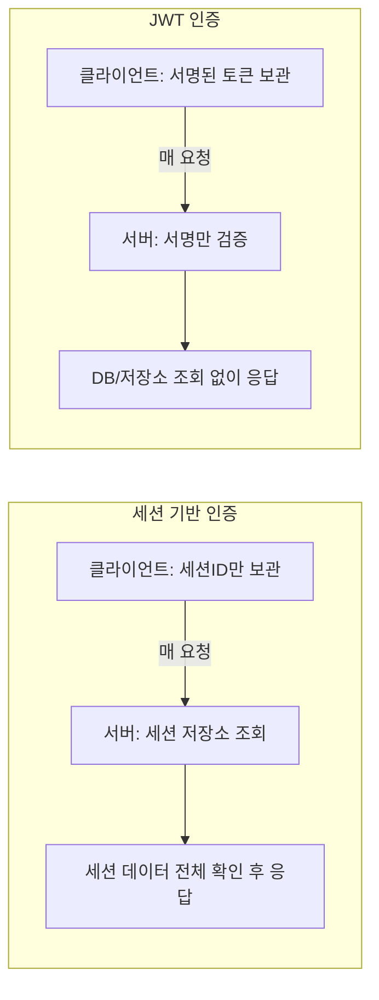

### 세션 기반 인증

- 사용자가 로그인한 후, 서버가 각 사용자를 위해 고유한 세션을 생성하고 관리
- 서버는 세션 데이터를 저장, 클라이언트는 세션ID로 사용자 식별
- 세션은 서버 메모리나 DB에 저장, 일정 시간 이후 만료됨

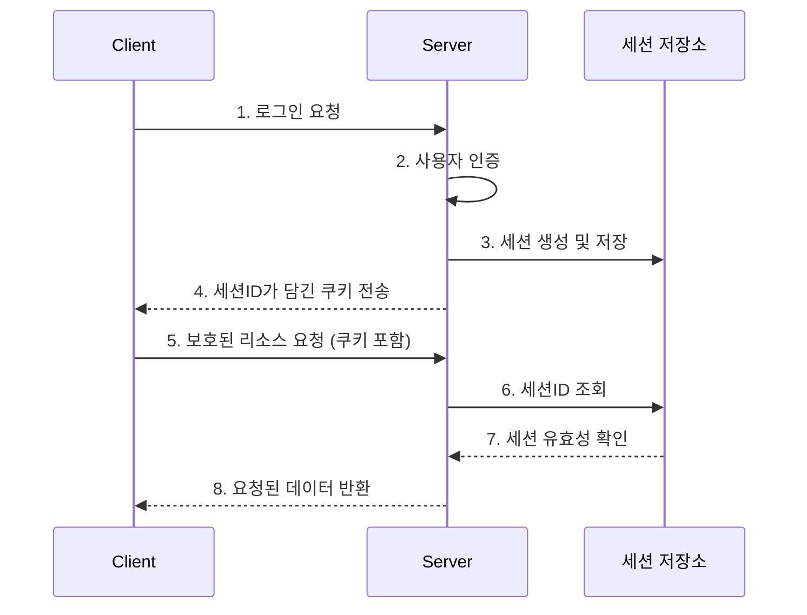

**장점**
- 안전한 서버측 세션 관리 제공
- 로그아웃 시 세션 쉽게 취소 가능

**제약**
- 대규모 분산 환경에서의 한계, 세션 데이터를 서버에 저장해야 함
- 로드 밸런싱 시스템에서 확장성 제한

**세션 저장 위치**
- 메모리: 서버 간 세션 공유 불가
- DB: 안정적이지만, 매 요청마다 조회해서 상대적으로 느림
- Redis: 빠르고 여러 서버가 공유 가능

### JWT

클라이언트와 서버 간 사용자 정보를 안전하게 전달하기 위한 토큰 기반 인증 메커니즘. 헤더, 페이로드, 서명을 포함하여 서버가 별도로 저장할 필요가 없다.

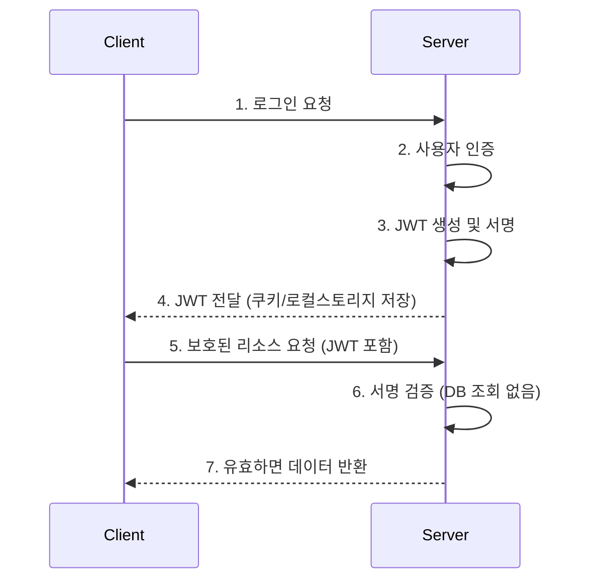

**장점**
- 무상태 인증 → 확장 가능하고 분산된 애플리케이션에 적합
- 서버 측 세션 저장의 필요성 제거

**제한**
- 만료되기 전에 취소가 어렵다
- 토큰은 클라이언트 측에 안전하게 보관되어야 한다

**JWT가 "보안에 강하다"는 말의 진짜 의미**

JWT는 탈취가 아니라 **위변조**에 강하다. 서명이 있어서 클라이언트나 중간자가 payload를 조작해도 검증에서 걸러진다. 흔히 말하는 "JWT가 보안에 강하다"는 표현은 실제로는 두 가지를 뭉뚱그린 것이다.

1. **위변조에 강함** — 서명 덕분에 payload 조작이 걸러짐 (탈취가 아니라 변조 방지)
2. **서버 확장성/성능** — 서버가 세션 저장소를 안 뒤져도 서명 검증만으로 신뢰 가능 → stateless라 수평 확장이 쉬움 (이것도 보안이 아니라 아키텍처 이점)

**탈취 저항성 자체는 오히려 세션 방식이 유리하다:**
- 세션: 서버가 세션ID를 보고 즉시 폐기(revoke) 가능. 탈취돼도 관리자가 "이 세션 죽여" 하면 즉시 끝.
- 순수 stateless JWT: 서버가 상태를 안 가지므로, 만료 전까지는 탈취된 토큰을 무효화할 방법이 없다. "유효시간이 짧더라도 그 안에 탈취해서 쓸 수 있는 거 아니냐"는 지적이 정확히 이 약점을 찌르는 것이다.

JWT 인증은 각 요청 시 데이터베이스 쿼리와 관련된 오버헤드를 줄여 분산 애플리케이션의 지연 문제를 해결하지만, JWT를 생성하는 시스템은 JWT가 서버를 벗어나면 그에 대한 제어를 거의 할 수 없다. 허가되지 않은 당사자가 JWT를 얻으면, 서버는 페이로드와 서명을 신뢰하기 때문에 해당 JWT를 무효화할 방법이 없다.

JWT 구현이 세션과 유사한 사용자 경험(재로그인 없는 장기 세션)을 흉내내려다 보니, 때때로 며칠 또는 몇 주 동안 유효한 JWT를 만드는 경우가 있는데, 이는 위 무효화 불가 문제를 그대로 키우는 선택이다.

| 상황 | 추천 인증 방법 |
|---|---|
| 기존 웹사이트 | 세션 기반 인증 |
| 은행 및 금융 애플리케이션 | 세션 기반 인증 |
| 콘텐츠 관리 시스템 (CMS) | 세션 기반 인증 |
| 기업용 사내 애플리케이션 | 세션 기반 인증 |
| REST API | JWT 인증 |
| 단일 페이지 애플리케이션 (SPA) | JWT 인증 |
| 모바일 애플리케이션 | JWT 인증 |
| 마이크로서비스 아키텍처 | JWT 인증 |
| 다중 도메인 인증 (SSO) | JWT 인증 |
| 클라우드 네이티브 및 분산형 애플리케이션 | JWT 인증 |

### 세션 정보를 서버에 저장하는 게 흔한가 — 그리고 보안상 필요한 조치인가

실무에서 "revoke 가능한" 인증을 요구하는 서비스라면 세션 정보를 서버에 저장하는 게 사실상 표준이다. 순수 stateless JWT(서버 저장 없음)는 오히려 소수파에 가깝고, 규모가 작거나 revoke 요구사항이 낮은 서비스에서나 쓰인다.

업계에서 실제로 하는 방식들 (전부 "어딘가 저장"이 전제):
- Auth0, Okta 같은 상용 IdP: refresh token은 항상 서버(DB)에 기록, access token도 필요시 introspection API로 실시간 상태 확인 가능
- 대형 서비스(은행, 커머스): 대부분 Redis에 세션/토큰 상태 유지
- 심플한 사이드 프로젝트/MVP: 저장 없이 만료시간에만 의존하는 경우도 많음

즉 "저장하느냐 마느냐"는 기술 트렌드가 아니라 **요구사항 문제**다.

**저장이 필요해지는 조건:**
1. 즉시 로그아웃/강제 종료 기능이 있어야 함 — 저장 없인 원천적으로 불가능
2. 탈취 대응이 요구사항 — "계정 도용 신고 오면 즉시 세션 끊어야 함" 같은 게 있으면 필수
3. 동시 로그인 제한/기기 관리 — "다른 기기에서 로그아웃" 기능은 세션 목록을 서버가 알아야 가능
4. 규제/컴플라이언스 — 금융, 의료 등은 감사(audit)를 위해 세션 이력 자체를 남겨야 하는 경우도 있음

**반대로 저장 없이도 괜찮은 경우:**
- 탈취 시 피해가 크지 않음 (커뮤니티 게시글 수준의 서비스)
- 로그아웃이 그냥 UX상 버튼이지 보안 기능은 아님 — 사용자가 안 누르면 어차피 만료시간까지 유효한 건 똑같음
- 토큰 수명을 짧게(예: 15분) 잡아서 노출 윈도우 자체를 줄이는 걸로 대체 가능한 경우

**정리**: "세션 저장 = 보안 강화"라는 인과관계가 아니라, **"revoke가 필요한 요구사항 → 그걸 구현하려면 저장이 필수"**라는 인과관계다. 다만 긴 수명(예: 14일) + revoke 불가 조합은 일반적으로 권장되지 않는다. 보통 "저장 안 할 거면 수명을 짧게" 아니면 "수명 길게 갈 거면 저장해서 revoke 가능하게" 둘 중 하나를 택한다.

### 쿠키/토큰 탈취 자체의 위험

세션이든 JWT든 소지 기반(bearer) 자격증명이라, 탈취되면 서버는 요청을 보낸 게 진짜 사용자인지 판단할 방법이 없다. 세션ID를 훔친 공격자가 그대로 요청에 실어 보내면 서버는 "추적 중인 세션 목록에 있고 유효하다"고만 판단하고 연결해준다. 이것이 세션 하이재킹이다.

탈취 "이후" 대응(revoke)과 별개로, 탈취 "확률" 자체를 낮추는 조치들도 있다:
1. **HttpOnly 쿠키** — JS가 `document.cookie`로 못 읽게 함 → XSS로 탈취하는 경로 차단
2. **Secure 플래그** — HTTPS로만 전송 → 중간자(MITM) 공격으로 평문 탈취되는 경로 차단
3. **SameSite=Strict/Lax** — 다른 사이트에서 이 쿠키를 실어 요청 보내는 CSRF류 공격 차단
4. **IP/User-Agent 바인딩** — 세션 생성 시점의 IP/기기 정보와 다르면 의심(단, 모바일 네트워크 전환 등 오탐 있음)
5. **짧은 만료 + 활동 기반 갱신** — 탈취된 쿠키의 유효 기간 자체를 줄임

세션이든 JWT든 탈취 자체를 막는 능력은 동일하고, 차이는 **탈취 이후 얼마나 빨리 차단할 수 있는가**이며 이는 서버가 상태를 갖고 있는지에 달려있다.

---

## OAuth 2.0

사용자의 비밀번호를 직접 받지 않고, 신뢰할 수 있는 외부 서비스를 통해 사용자의 정보에 접근할 권한을 위임받기 위한 개방형 권한 프레임워크. 비밀번호를 공유하지 않고도 제3자 애플리케이션에 제한적인 접근 권한을 부여할 수 있다.

- **OAuth 2.0**은 인가(authorization)를 처리한다 — "이 앱은 어떤 정보에 접근할 수 있는가?"
- **OpenID Connect (OIDC)**는 인증(authentication)을 처리한다 — "이 사용자는 누구인가?"

OIDC는 OAuth 2.0을 기반으로 구축된다. 표준 OAuth 흐름에 사용자 식별 정보가 포함된 JWT인 `id_token`을 추가하고, `/userinfo` 엔드포인트와 표준화된 `openid` 스코프를 포함한다.

### Authorization Code Flow

가장 널리 쓰이는 OAuth2 플로우로, code를 access token으로 교환하는 2단계 과정을 통해 access token이 브라우저 URL에 노출되지 않도록 한다.

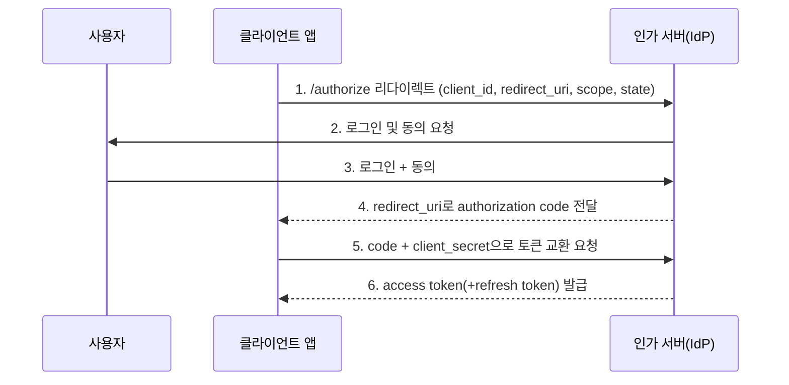

**원래 이 흐름이 안전한 이유**: code를 access token으로 교환할 때 `client_secret`을 같이 보낸다. 이 client_secret이 "나는 진짜 등록된 클라이언트(서버) 맞다"를 증명하는 역할을 한다. 즉 code를 누가 가로채도, client_secret이 없으면 토큰 교환이 안 되니까 안전하다.

### SPA/모바일 앱과 PKCE

> 참고: SPA(단일 페이지 앱)나 모바일 앱처럼 client secret을 안전하게 저장할 수 없는 경우, Authorization Code Flow에 PKCE(Proof Key for Code Exchange)를 추가로 사용하는 것을 고려해야 한다.

**왜 SPA/모바일에서 기존 방식이 무너지는가**: client_secret은 서버에만 존재해야 의미가 있다(서버 코드는 유저가 못 봄). 그런데:
- SPA: 자바스크립트 코드가 브라우저에 통째로 다운로드됨 → 개발자도구로 소스를 까보면 client_secret이 그대로 노출
- 모바일 앱: APK/IPA를 디컴파일하면 하드코딩된 client_secret이 나옴

즉 "비밀"이라는 전제 자체가 성립하지 않는다. client_secret을 안전하게 숨길 곳이 없는 클라이언트라는 게 문제의 본질이다.

**그럼 뭐가 위험해지는가 — 구체적 공격 시나리오**: client_secret 없이 code만으로 토큰 교환이 된다면
1. 공격자가 앱의 redirect_uri를 가로채거나(악성 앱이 커스텀 URL 스킴을 가로채는 방식 등), 로그 등에서 authorization code를 탈취
2. 그 code를 들고 직접 토큰 엔드포인트에 요청 → client_secret이 필요 없으니 그냥 토큰 발급받음
3. 공격자가 피해자 계정의 access token 확보

이것이 "code 가로채기(authorization code interception)" 공격이다.

**PKCE가 하는 일 — client_secret을 "그 요청을 시작한 사람"으로 대체**: PKCE는 client_secret(고정된 비밀) 대신, 매 로그인 시도마다 새로 만드는 일회성 비밀을 쓴다.

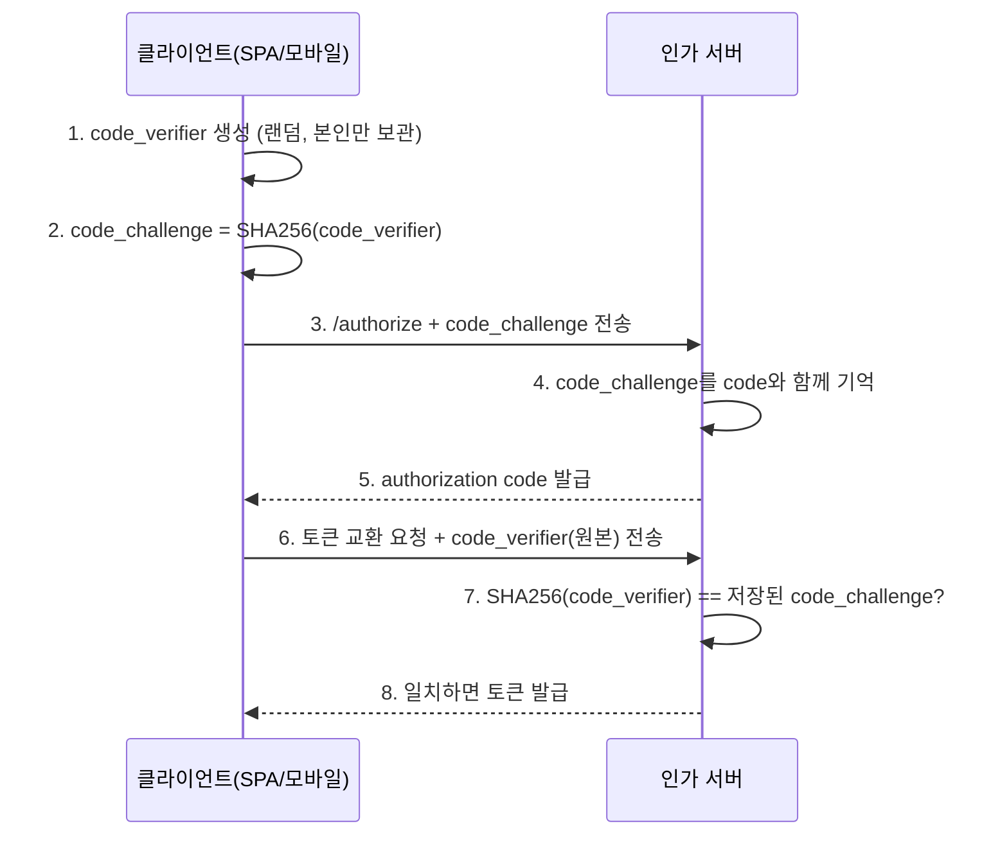

**왜 이게 안전한가**: 공격자가 authorization code만 가로챘다면, code_verifier(해시 전 원본)는 여전히 정당한 클라이언트 안에만 존재한다. code만 갖고 토큰 교환을 시도해도 code_verifier가 없으면 검증을 통과하지 못해 토큰 발급이 실패한다.

즉 **client_secret(고정, 노출되면 끝) → code_verifier(그 세션에서만 유효한 일회용 증명)**로 바꿔서, "비밀을 숨길 곳이 없다"는 SPA/모바일의 근본적 제약을 우회한 것이다. 이는 앞서 다룬 refresh token rotation과 같은 원칙의 반복이다 — 고정된 비밀은 한번 노출되면 영구적으로 위험하지만, 그 순간에만 유효한 값은 노출돼도 재사용이 막힌다.

---

## Refresh Token

액세스 토큰의 유효 기간을 연장하기 위한 토큰. 일반적으로 리프레시 토큰은 액세스 토큰과 함께 발급되며, 기존 액세스 토큰이 만료될 때 추가적인 액세스 토큰을 발급할 수 있도록 한다. 리프레시 토큰은 일반적으로 인증 서버 자체에 안전하게 저장된다.

리프레시 토큰은 액세스 토큰과 함께 작동하여, 반복적인 로그인 없이 장기간의 세션을 가능하게 한다. 실제 작동 방식:

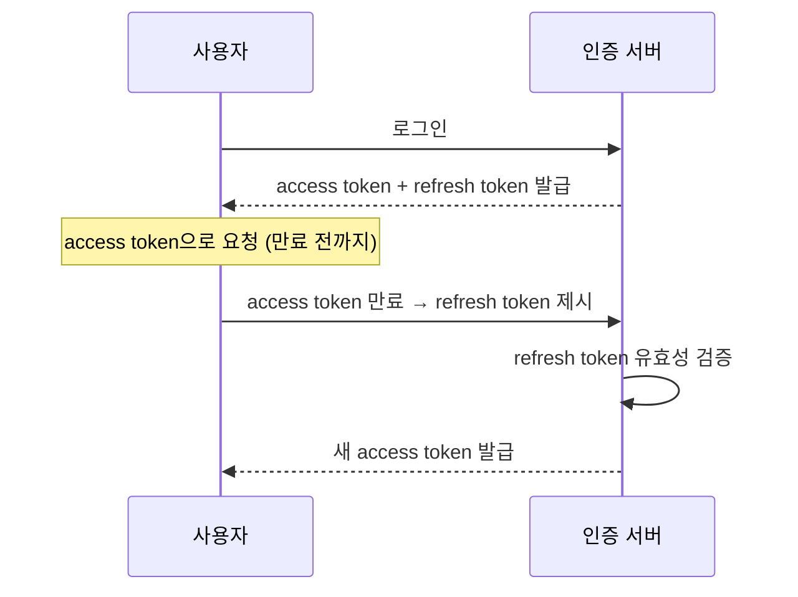

- 사용자가 클라이언트 애플리케이션에 로그인하고, 인증 서버를 통해 인증을 받는다.
- 서버는 사용자에게 access token과 함께 refresh token을 발급한다.
- access token은 사용자가 지정된 만료 시점까지 접근 권한을 부여한다.
- refresh token은 만료 시점에 새로운 access token을 요청하기 위해 사용된다.
- 인증 서버는 refresh token의 유효성을 확인하여 새로운 access token을 발급한다.

리프레시 토큰의 또 다른 중요한 차이점은, access token보다 훨씬 긴 유효 기간을 갖는다는 것이다. 예를 들어 Microsoft Identity Platform의 refresh token은 대부분의 경우 90일, 단일 페이지 앱의 경우 24시간의 고정된 유효 기간을 갖는다.

| | Access Token | Refresh Token |
|---|---|---|
| 사용자 경험 | 사용자 인증 및 권한 부여를 사전에 수행 | 재인증 절차 없이 다시 승인됨 |
| 전송 및 보관 | 안전한 채널(HTTPS)을 통해 전송 후 클라이언트에 저장 | HTTPS로 전송되며, 인증 서버에 저장 |
| 보안 고려사항 | 짧은 수명, 암호화, 접근 권한 회수 기능으로 강력한 보안 제공 | 긴 수명은 낮은 갱신 빈도와 강력한 취소 기능으로 상쇄 |
| 유효기간 | 몇 시간 이내(30~90분이 이상적) | 액세스 토큰보다 훨씬 긴 시간(일반적으로 수일) |
| 보관 장소 | 브라우저 메모리 또는 로컬 저장 공간 | 인증 서버에 저장 |
| 범위 | 자원 또는 시스템에 대한 접근 | 만료된 접근 토큰 갱신 |
| 취소 동작 | 일반적으로 설정된 만료 시점 이후에는 취소 불가능 | 갱신하지 않음으로써 접근을 거부하도록 설계됨 |
| 노출 위험 | 오용/도난 시 단기적인 영향 | 효과적으로 회전할 경우 즉각적인 위험이 줄어듦 |
| 갱신 프로세스 | 정해진 기간 후 자동 만료, 리프레시 토큰 검증 시 재생성 | access token 만료 시 트리거, 검증 후 갱신 발급 |

### 만료 정책 — Sliding vs Absolute

**1) Sliding expiration (매번 갱신 시 연장)**: refresh token을 쓸 때마다 새 refresh token을 발급하면서 만료시간도 그 시점부터 다시 카운트한다. 사용자가 계속 활동하면 이론상 refresh token은 절대 안 죽는다 → **무기한 로그인 유지가 실제로 가능**해진다.

**2) Absolute expiration (절대 상한선)**: sliding과 별개로 "발급 후 N일이 지나면 무조건 죽는다"는 상한을 하나 더 둔다. sliding으로 계속 연장되더라도, 이 절대 상한을 넘으면 무조건 재로그인을 요구한다.

**왜 무기한 연장이 문제인가**: 탈취된 refresh token이 rotation을 계속 통과하면(=공격자가 정상적으로 계속 사용하면), 이 세션은 영원히 살아있는 세션이 된다. "90일 이상 안 쓰면 죽어야지"가 아니라 "쓰기만 하면 영원히 산다"는 건 보안 감사 관점에서 바람직하지 않다.

**그래서 실무는 보통 둘을 같이 쓴다**:
```
sliding expiration: 매 사용마다 연장 (예: 사용할 때마다 +14일)
absolute expiration: 최초 발급 후 절대 상한 (예: 최대 90일, 아무리 활동해도 이 시점엔 무조건 재로그인)
```
이렇게 하면 "계속 쓰는 사용자는 편하게 로그인 유지" + "그래도 언젠가는 한번 재인증시켜야 함"이라는 두 요구를 동시에 만족시킨다. rotation+sliding을 도입하는 시스템은 반드시 absolute expiration을 짝으로 둬야 한다 — sliding만 있고 absolute가 없으면 반쪽짜리 설계다.

### Refresh Token Rotation

보안 강화를 위해, 새로운 access token이 생성될 때마다 자동으로 새로운 refresh token을 발급하고 기존 토큰을 무효화하는 방식. 액세스 세션이 긴 경우, 또는 기존 refresh token이 도용되거나 악용될 위험이 있는 경우에 특히 유용하다.

**재사용 탐지(Reuse Detection)**: rotation의 진짜 목적은 회전 자체가 아니라 탈취 탐지에 있다. refresh token은 1회용으로 소모되고, 이미 rotate되어 죽은(사용된) 토큰이 다시 들어오면 "탈취 의심"으로 판단해 그 토큰 계열(family) 전체 — 즉 그 사용자의 관련 세션 전체를 강제 종료한다.

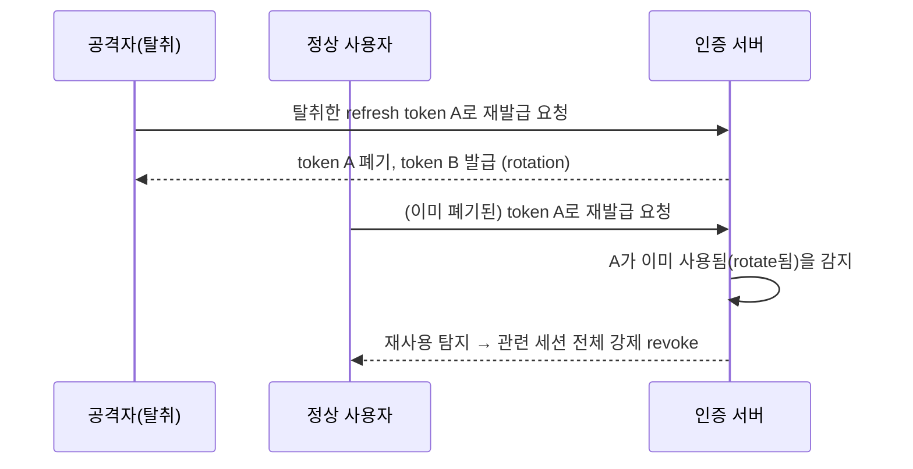

재사용 탐지가 없다면, rotation을 도입해도 실질적 보안 효과가 없다. 탈취된 토큰이 먼저 사용되고 rotate되면, 원래 사용자가 나중에 (이미 폐기된) 옛 토큰으로 요청했을 때 그냥 401로 처리되고 "재로그인 하면 그만"이라고 넘어가게 되는데, 이 경우 탈취 사실 자체가 아무도 모르게 묻힌다. 즉 **"이 토큰, 이미 한번 쓴 거 아냐?"를 판단하려면 이미 쓴 토큰의 이력을 어딘가 기록해둬야 하고, 순수 stateless 구조로는 이 재사용 탐지 자체가 불가능**하다.

### Refresh Token 저장 위치

- localStorage에 저장하면 안 된다 — XSS로 탈취될 경우 그대로 노출된다.
- SPA라면 백엔드가 설정하는 HttpOnly + Secure 쿠키에 저장해야 한다.
- refresh token은 revoke 가능해야 하고 rotation을 지원해야 하며, access token 정책과 독립적인 만료 기간을 가질 수 있어야 한다.

---

## JWT 서명 방식: 대칭키(HMAC) vs 비대칭키(ES256) + JWKS

### 대칭키 (HMAC, 예: HS512)

서명도 검증도 같은 키(secret)로 한다. 비유하면 "같은 도장 하나로 찍고(서명) 확인도(검증) 하는" 구조.

- 장점: 구현 단순, 키 하나만 관리
- 단점: 검증하려는 모든 서비스가 이 secret을 알아야 한다. 서비스가 여러 개면 secret이 여러 곳에 배포되어 있어야 하고, 그중 하나라도 뚫리면 그 secret으로 **위조 서명까지 가능**하다(secret만 있으면 검증뿐 아니라 발급도 가능하니까).

### 비대칭키 (ES256 등) + JWKS

- **ES256**: 서명 알고리즘 이름(Elliptic Curve + SHA256, 비대칭키 방식)
- **JWKS(JSON Web Key Set)**: JWT 서명을 검증할 때 필요한 공개키들을 모아놓은 JSON 문서. 보통 `/.well-known/jwks.json` 같은 엔드포인트로 공개된다.

서명은 개인키(private key)로만, 검증은 공개키(public key)로 한다. 공개키는 누구한테 줘도 상관없다(그걸로 위조는 못 하고, 검증만 된다). 비유하면 "인감도장(개인키)은 발급자만 갖고, 인감증명서(공개키)는 누구나 받아서 진짜인지 대조만 할 수 있는" 구조.

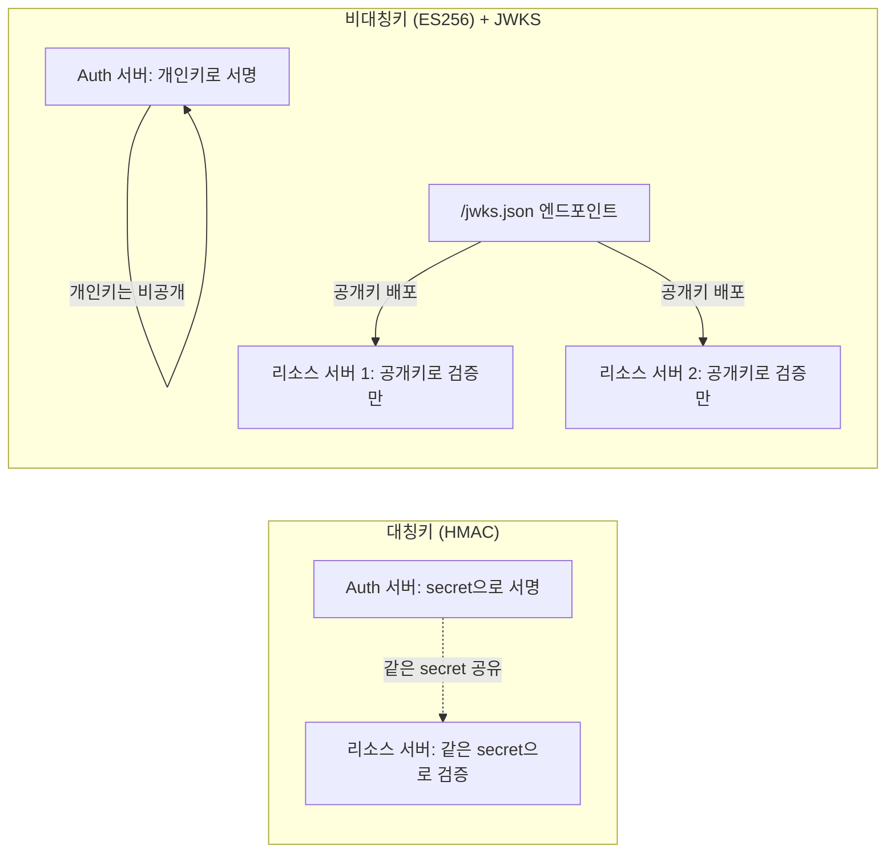

**핵심 차이**: 공개키를 아무리 많은 서비스에 뿌려도, 그걸로는 위조 서명을 만들 수 없다. 검증만 가능하고 발급은 불가능하다. 그래서 Gateway나 여러 리소스 서버가 각자 공개키를 들고 있어도 안전하다. HMAC이었다면 Gateway가 그 secret을 알아야 검증 가능한데, 그러면 Gateway가 뚫렸을 때 "검증용으로 준 키"로 "발급"까지 위조 가능해진다. 비대칭키는 이 위험을 원천 차단한다.

**JWKS를 쓰는 실질적 이유**:
- **키 회전(rotation)이 쉬움**: 각 키에 `kid`(key ID)를 붙여서 여러 키를 동시에 공개해둘 수 있다. 새 키로 갈아탈 때 구키/신키를 겹치는 기간(overlap) 동안 같이 노출해서 무중단 전환이 가능하다.
- **비밀을 나눠줄 필요가 없음**: 검증하는 쪽이 발급자의 개인키를 몰라도 검증이 가능해서, 검증 주체를 여러 서비스로 늘려도 안전하다.

**발급/검증 주체가 분리되는 순간, 비대칭키가 사실상 필수가 된다.** 발급자와 검증자가 같은 서비스(자기 자신)라면 대칭키로도 문제가 없지만, 발급 서버와 여러 리소스 서버가 물리적으로 분리되어 있다면 대칭키의 secret을 모든 서비스에 나눠줘야 하는 위험한 구조가 된다.

| | 대칭키 (HMAC) | 비대칭키 (ES256+JWKS) |
|---|---|---|
| 키 개수 | 1개(모두 공유) | 2개(개인키: 발급자만 / 공개키: 배포) |
| 검증자가 위조 가능한가 | 가능(같은 키로 서명도 됨) | 불가능(공개키론 서명 못 만듦) |
| 키 노출 시 피해 | 시스템 전체(발급+검증 둘 다 위조 가능) | 공개키 노출은 무해, 개인키만 지키면 됨 |
| 여러 서비스가 검증해야 할 때 | secret을 다 나눠줘야 함(위험 확산) | 공개키만 공유(안전) |
| 키 회전 | secret 하나 바꾸면 기존 토큰 다 깨짐, 무중단 어려움 | `kid`로 신/구 키 동시 노출 → 무중단 회전 쉬움 |

---

## JWT를 수동으로 만료(revoke)시키는 방법

순수 JWT는 서버가 상태를 안 가지므로, "그 토큰 하나를 콕 집어 죽이는" 기능이 원래 없다. 실무에서 쓰는 방법은 전부 어떤 형태로든 서버 측 상태를 다시 도입하는 것이다.

### 1) 블랙리스트(deny list)

폐기할 토큰(또는 그 `jti` — JWT ID 클레임)을 Redis 같은 곳에 저장해두고, 매 요청마다 "이 토큰 블랙리스트에 있나?" 체크한다.
- 장점: 구현 간단
- 단점: 결국 매 요청 조회가 필요해서 stateless 이점이 사라진다.

### 2) 화이트리스트/세션 원장 방식

반대로 "유효한 세션"만 서버에 기록해두고, 매 요청마다 존재 여부+상태(status)를 확인한다. 특정 세션 하나만 revoke하면 그 토큰(그 로그인 세션)만 즉시 죽는다. 블랙리스트와 개념은 거울상이지만, "이미 발급된 다수의 유효 토큰 중 하나만 죽이기"에 더 자연스럽게 맞는다.

### 3) 버전 번호(`ver` 클레임)

사용자 레코드에 `tokenVersion` 필드를 두고, JWT에도 발급 시점의 버전을 클레임(`ver`)으로 박아둔다. 검증 시 "토큰의 ver == 현재 사용자 ver"인지 확인한다. 비밀번호 변경/전체 로그아웃 시 `tokenVersion`을 1 올리면 그 사용자의 **모든** 기존 토큰이 한번에 무효화된다. "이 사용자 전체 세션 다 죽여" 같은 대량 revoke에 적합하다(개별 세션 하나만 죽이기엔 부적합 — 전체가 다 죽으므로).

### 4) 짧은 만료시간 + refresh만 막기 (약한 버전)

access token 자체는 못 죽이고, 그냥 짧게(예: 5~15분) 만료되게 두고 refresh token 발급을 막아서 "곧 죽게" 만든다. 진짜 즉시 차단은 아니고 "몇 분 내 자동 만료"라 탈취 대응으로는 부족하지만, 구현이 제일 간단해서 revoke 요구사항이 약한 시스템에서 쓴다.

**정리**: "순수 JWT를 즉시, 개별적으로 만료시키는 기능"은 존재하지 않고, 항상 서버 측에 무언가(블랙리스트든 화이트리스트든 버전이든)를 둬야 한다.

### "JWT에서 로그아웃"의 진짜 의미

로그아웃 버튼을 클라이언트에서만 처리(토큰 삭제)하면, 그 토큰을 어디 복사해둔 사람(탈취자, 다른 기기)은 만료시간까지 계속 사용할 수 있다. 이건 "이 브라우저에서만 로그아웃"이지 "이 계정 로그아웃"이 아니다.

**로그아웃은 JWT를 죽이는 게 아니라, JWT가 참조하는 서버측 세션을 죽이는 것이다.** JWT 자체(서명, exp)는 전혀 안 건드리고, 그 JWT가 가리키는 서버측 세션의 상태를 REVOKED로 바꾸는 식으로 구현한다. JWT는 만료시간까지 서명상으로는 계속 "유효"하지만, 세션이 죽었으므로 실질적으로 쓸모없어진다. "JWT 로그아웃"이라는 표현 자체가 오해를 부르기 쉽고, 완전 stateless JWT라면 로그아웃 버튼은 사실상 "클라이언트 쪽에서 잊어버리기"에 불과하다.

---

## 토큰과 세션을 함께 쓰는 이유, 그리고 검증 시점의 스펙트럼

JWT는 **"위조 안 됐다"**를 증명하고, 세션은 **"지금도 유효하다"**를 증명한다. 이 둘을 얼마나 강하게 묶어 쓰느냐는 시스템 요구사항에 따라 달라지며, 크게 세 단계의 스펙트럼으로 나눌 수 있다.

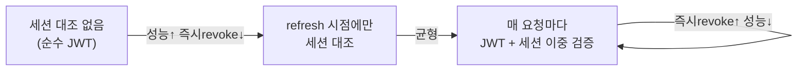

**1) 매 요청마다 세션 대조 안 함**: JWT 서명/만료만 검증하고 끝. 세션 저장소가 있어도 인증 검증 경로에는 관여하지 않는다.

**2) Refresh 시점에만 세션 대조**: API 요청마다는 JWT 서명/만료만 검증(Redis 조회 없음)하고, refresh token을 사용할 때(즉 access token이 만료됐을 때)만 세션 저장소를 조회하고 rotate한다. access token 검증 경로엔 세션이 안 끼어서 빠르지만, access token 수명 동안은 즉시 revoke가 안 된다.

**3) 매 요청마다 JWT + 세션 이중 검증**: "발급 시점 서명"과 "지금 상태"를 매 요청마다 이중으로 확인한다(JWT 서명/만료 검증 → 세션 저장소에서 status 체크). 두 검증이 모두 통과해야 요청을 허용하며, 이렇게 해야 revoke가 즉시 반영된다.

| | 세션 대조 없음 | refresh 시점만 대조 | 매 요청 대조 |
|---|---|---|---|
| 성능/확장성 | 최고 (조회 0) | 좋음 (access token 수명 동안 조회 없음) | 상대적으로 낮음 (매 요청 조회 1개 추가) |
| 즉시 revoke | 불가능 | access token 수명만큼 지연 | 즉시 |
| 구현 복잡도 | 가장 단순 | 중간 | 가장 복잡 |
| 적합한 경우 | 탈취 피해가 작은 서비스, 내부용 | 일반적인 B2C 서비스 | 강한 보안 요구(B2B, 금융, 즉시 강제로그아웃 필요) |

"어느 방식이 더 좋은가"에 정답은 없고, "access token 수명 동안 revoke 안 되는 걸 감수할 수 있는가"라는 질문의 답에 달려있다.
- access token을 아주 짧게(예: 5분) 잡으면 세션 대조 없이도 노출 윈도우가 작아서 2번 방식으로도 충분할 수 있다.
- access token을 1시간 이상 길게 잡으면서 즉시 revoke도 필요하면, 3번처럼 매 요청 세션 대조가 사실상 필수다.

업계에서 흔히 쓰는 절충안은 access token은 짧게(5~15분) 잡아 세션 대조 없이 서명만 검증(성능 우선)하고, refresh token은 세션 저장 + rotation + 재사용 탐지를 갖춰 refresh 시점에만 revoke를 반영하는 방식이다. 이러면 최악의 경우에도 access token 수명만큼만 지연 있는 revoke가 되어서, 즉시성은 떨어지지만 매 요청 조회 부담 없이 균형을 잡을 수 있다.

---

## 실제 아키텍처 사례 비교

같은 회사 안에서도 서비스별로 인증 아키텍처의 성숙도와 철학이 다를 수 있다. 세 가지 실제 사례를 비교하며 위 개념들이 실전에서 어떻게 적용/생략되는지 정리한다. (서비스명은 예시로 A/B/C로 대체)

### 세 서비스 비교표

| | 서비스 A (레거시, 초기 단계) | 서비스 B (자체 Auth 서버) | 서비스 C (분리형 SaaS 인증) |
|---|---|---|---|
| 토큰 발급 주체 | 외부 auth 서버(위임) | 자체 발급 | 별도 Auth 서비스 |
| 토큰 서명 방식 | 대칭키(secret 공유) | 대칭키(HMAC) | 비대칭키(ES256+JWKS) |
| Refresh Rotation | 없음(고정 수명) | 있음(매 refresh마다) | 있음 |
| 재사용 탐지 | 해당 없음 | **없음** | 있음(설계에 명시) |
| 권한(role/permission) 위치 | - | 토큰 클레임에 직접 포함 | 세션에만 보관(토큰엔 안 넣음) |
| 로그아웃 구현 | 클라이언트 쿠키 삭제만(서버측 무효화 없음) | Redis 세션 revoke | 세션 상태(status) 변경 + 캐시 무효화 |
| 필터체인 정책 | STATELESS, 화이트리스트 permitAll | permitAll 넓게 열고 컨트롤러 메소드에서 인가 체크 | Gateway가 fail-closed로 전면 차단(PEP) |
| 인증 검증 위치 | 각 서비스가 직접 | 각 서비스가 직접 | Gateway가 대신 검증 후 헤더로 전달 |

### 사례 A: 세션/블랙리스트 없이 클라이언트 삭제만으로 로그아웃하는 경우

로그아웃 엔드포인트가 단순히 쿠키를 빈 값으로 덮어쓰는 것뿐이고, 서버측 세션 revoke나 블랙리스트가 전혀 없는 구조도 실무에 존재한다. 이런 경우:
- JWT 자체(서명, exp)는 전혀 건드리지 않는다.
- 로그아웃을 눌러도 그 access token을 어디 복사해둔 사람은 만료시간(예: 14일)까지 계속 유효하다.
- Redis가 있어도 세션/블랙리스트 용도가 아니라 일반 캐시(알림, 인증코드 등)와 분산락에만 쓰일 수 있다.

이건 "구현을 잘못한 것"이라기보다 "revoke를 요구사항으로 안 잡은 것"일 수 있다. 다만 **긴 수명(14일) + revoke 불가**의 조합은 일반적으로 권장되는 조합은 아니다 — 저장 안 할 거면 수명을 짧게, 수명을 길게 갈 거면 저장해서 revoke 가능하게 하는 것이 정석이다.

### 사례 B: Refresh Rotation은 있지만 재사용 탐지가 빠진 경우

자체 Auth 서버가 access token 발급(HMAC 서명, role을 클레임에 직접 포함)과 refresh token rotation을 모두 구현하고 있지만, 재사용 탐지 로직이 빠진 경우가 있다.

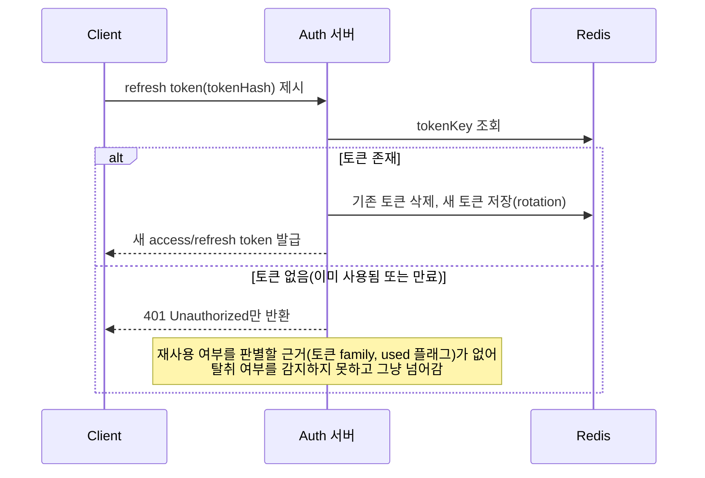

이 경우 IP 검증도 "soft"하게(다르면 경고 로그만 남기고 차단은 안 함) 처리되는 경우가 흔한데, 탈취 탐지의 보조 신호로조차 활용되지 않으면 로그만 쌓이고 실질적 대응은 없는 상태가 된다.

**시나리오로 보면 차이가 명확하다**:
1. 공격자가 refresh token을 탈취해서 먼저 사용 → rotate됨 → 옛 토큰 삭제됨 → 새 토큰 발급, 공격자가 그 새 토큰을 가짐
2. 진짜 사용자가 (이미 rotate된) 옛 토큰으로 요청 → 토큰 없음 → 401
3. 진짜 사용자는 "어? 로그인 풀렸네" 하고 재로그인함
4. **탈취 여부를 아무도 모르고 넘어감** — 공격자는 자기가 가진 새 토큰으로 계속 정상 접근 가능

즉 "rotation은 있지만 재사용 탐지가 빠진 반쪽짜리 구현"이다. **rotation의 진짜 목적은 회전 자체가 아니라 탈취 탐지이며, 재사용 탐지 없이는 rotation을 도입해도 실질적 보안 효과가 없다.**

### 사례 C: Gateway 분리 + fail-closed 검증

인증 서버(Auth)와 게이트웨이(Gateway)를 분리하고, Gateway가 매 요청마다 아래 순서로 검증하는 구조.

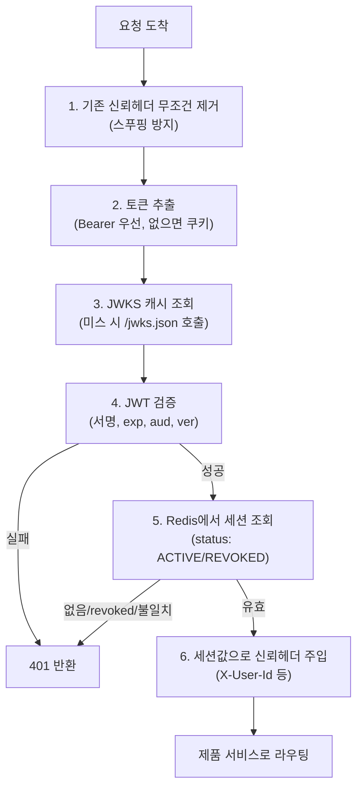

이 구조의 특징:
- Gateway는 **PEP(정책 집행점, Policy Enforcement Point)** 역할만 하고, 실제 인가 판단(PDP, Policy Decision Point)은 각 제품 서비스로 위임한다.
- 신뢰헤더는 매번 진입점에서 지우고 세션값으로 재주입한다 — 외부에서 헤더를 위조해 들어오는 것을 원천 차단하기 위함이다.
- **fail-closed(deny-by-default)** 원칙: 세션이 없거나(캐시미스), revoked거나, 식별자가 불일치하면 무조건 401. 가용성보다 보안을 우선하는 설계다. 반대(fail-open: 없으면 통과)를 택하면 저장소 장애 시 인증 우회가 가능해지는 심각한 보안 구멍이 생긴다.
- 권한 데이터(permissions)는 토큰에 넣지 않고 세션에만 저장한다 — 토큰 크기를 줄이고, 인가 정보를 세션 재조회로 갱신 가능하게 하기 위함이다.

**Refresh 시점 권한 재조회의 트레이드오프**: refresh 시 토큰만 회전하고 세션의 권한 스냅샷(로그인 시점 값)을 그대로 재사용하면, 세션이 살아있는 동안(최대 절대만료 기간) 관리자가 권한을 변경해도 반영이 안 될 수 있다. 이는 "매 요청마다 권한 원장을 조회하는" 방식 대비 명백한 성능-정합성 트레이드오프다. 개선 방향은 refresh 시점마다 권한 데이터를 재조회해서 세션 스냅샷을 갱신하는 것이며, 이렇게 하면 stale 허용 범위가 "절대만료 기간"에서 "access token 만료 주기(=refresh 주기)"로 크게 줄어든다. 다만 이것도 **pull 방식**(다음 refresh 시점에 반영)이라, 권한 변경 즉시 반영(push 방식, 예: 권한변경 이벤트로 관련 세션을 즉시 revoke)까지는 아니다. pull 방식과 push 방식의 차이를 인지하고, 요구사항이 어느 수준까지 필요한지 판단하는 것이 중요하다.

### 사례 비교에서 얻는 결론

- **fail-closed vs fail-open**: 인증/세션 조회 실패 시 막을지 통과시킬지는 보안과 가용성의 트레이드오프이며, 대부분의 보안 민감 시스템은 fail-closed를 택한다.
- **PEP-PDP 분리**: Gateway(또는 별도 인증 서버)가 "누구인지"를 확인하고, 각 서비스가 "무엇을 할 수 있는지"를 판단하는 구조는 여러 리소스 서버를 운영할 때 결합도를 낮추는 데 유리하다. 다만 이 구조를 실제로 채택했는지는 문서만으로 알 수 없고, 리소스 서버 코드를 직접 확인해야 한다 — 같은 회사의 Gateway가 헤더를 투영하도록 설계되어 있어도, 특정 리소스 서버가 그 헤더를 전혀 읽지 않고 자체 인증 스택을 완전히 별도로 구현하고 있을 수도 있다.
- **Rotation은 재사용 탐지가 있어야 의미가 있다**: rotation 로직만 있고 재사용 탐지가 없으면, 탈취가 발생해도 조용히 묻히고 만다.
- **권한 재조회는 pull/push를 구분해서 설계해야 한다**: "언젠가 반영됨"과 "즉시 반영됨"은 요구사항 수준에 따라 다르게 설계해야 하는 별개의 목표다.

---

## 용어 미니 정리

| 용어 | 의미 |
|---|---|
| PEP (Policy Enforcement Point) | 요청을 실제로 통과시킬지 막을지 "집행"하는 지점 (예: Gateway) |
| PDP (Policy Decision Point) | 인가 여부를 "판단"하는 지점 (예: 각 리소스 서버의 인가 로직) |
| PIP (Policy Information Point) | 인가 판단에 필요한 데이터를 제공하는 지점 (예: 권한 원장 서버) |
| Fail-closed / Deny-by-default | 판단 불가 시 요청을 막는 원칙 (보안 우선) |
| Fail-open | 판단 불가 시 요청을 통과시키는 원칙 (가용성 우선, 보안 리스크 있음) |
| Sliding expiration | 사용할 때마다 만료시간이 연장되는 정책 |
| Absolute expiration | 사용 여부와 무관하게 발급 후 일정 기간이 지나면 무조건 만료되는 정책 |
