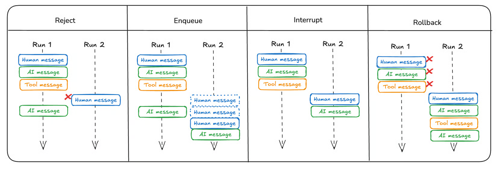

# Designing robust and predictable APIs with idempotency

> 참고: https://stripe.com/blog/idempotency

오류는 언제든 자연스럽게 발생할 수 있다. 이를 극복하려면 시스템 오류가 발생해도 안정적으로 동작하고, 복잡한 연동에서도 일관된 상태를 유지할 수 있도록 API와 클라이언트를 설계해야 한다.

## Planning for failure

예상 가능한 실패
- 초기 연결 시도 실패
- 서버가 작업을 처리하는 도중 통신이 끊어짐
- 요청은 성공적으로 처리됐지만, 그 사실을 클라이언트에 알리기 전에 연결이 끊어짐

→ 클라이언트 관점에서는 작업의 성공 여부를 알 수 없다. 분산 시스템에서 흔한 상황이다.

## Making liberal use of idempotency

서버 엔드포인트를 중복 호출이 가능하도록 구현한다. 사이드 이펙트가 한 번만 발생하도록 보장하면서 여러 번 호출할 수 있게 하는 것이다.

클라이언트는 오류를 발견하면 서버 상태와 일치할 때까지, 즉 성공적으로 완료될 때까지 재시도한다.

HTTP 요청으로 서브도메인을 추가할 수 있는 가상의 DNS 제공업체 API를 예로 들어 보자.

```bash
curl https://example.com/domains/stripe.com/records/s3.stripe.com \
    -X PUT \
    -d type=CNAME \
    -d value="stripe.s3.amazonaws.com" \
    -d ttl=3600
```

레코드를 만드는 데 필요한 모든 정보가 호출에 포함되어 있어, 클라이언트는 몇 번을 호출해도 안전하다. 서버는 도메인이 이미 존재해 중복 호출이라고 판단하면 요청을 무시하고 성공 상태 코드를 반환한다.

HTTP 규약에 따르면 [`PUT`과 `DELETE`는 멱등](https://tools.ietf.org/html/rfc7231#section-4.2.2)하다. 특히 [`PUT`](https://tools.ietf.org/html/rfc7231#section-4.3.4)은 요청 페이로드의 내용으로 대상 리소스를 완전히 생성하거나 대체한다는 의미이다. 현대적인 RESTful 표현에서는 부분 수정을 [`PATCH`](https://tools.ietf.org/html/rfc5789)로 나타낸다.

## Guaranteeing "exactly once" semantics

예: 결제 API → 멱등성 키

- 요청을 수행할 때 해당 작업을 식별하는 고유 ID를 생성해 일반 페이로드와 함께 서버로 전송한다.
- 서버는 이 ID를 받아 자신의 요청 상태와 연결한다.
- 클라이언트가 오류를 감지하면 같은 ID로 재요청한다.

케이스별 동작
- 재연결 실패: 두 번째 요청에서 서버가 처리한다.
- 운영 중 오류 발생: 서버가 이어서 진행한다. ACID 데이터베이스에서 롤백되었다면 전체 작업을 다시 시도하고, 그렇지 않다면 상태를 복구해 작업을 이어서 진행한다.
- 응답 실패: 서버는 성공적으로 완료된 작업의 캐시된 결과를 그대로 반환한다.

Stripe API는 `Idempotency-Key` 헤더와 함께 요청한다.

## Being a good distributed citizen

오류를 안전하게 처리하는 것도 중요하지만, 오류가 났을 때 클라이언트가 신중하게 처리하는 것도 중요하다.

- 서버 장애일 때는 재시도해도 문제가 해결되지 않고 상황이 더 나빠질 수 있다.
- 오류가 발생하면 클라이언트는 지수 백오프(exponential backoff)를 따르는 것이 권장된다. 오류가 반복될수록 대기 시간을 늘린다.
- 여기에 무작위성을 더한다. 많은 클라이언트가 거의 동시에 오류를 겪으면 재시도 시점도 비슷하게 정렬되어 서버에 과부하가 걸리는 thundering herd problem이 생길 수 있다. 대기 시간마다 약간의 무작위 jitter를 추가해 이를 막는다.

## Codifying the design of robust APIs

클라이언트/API 설계 원칙
- 실패 상황을 일관되게 처리한다.
  - 클라이언트가 원격 서비스에 대한 작업을 다시 시도하도록 안내한다.
- 실패 상황을 안전하게 처리한다.
  - 멱등성과 멱등성 키를 사용해 클라이언트가 고유한 값을 전달하고, 필요하면 재시도 요청을 할 수 있게 한다.
- 실패 상황을 책임감 있게 처리한다.
  - 지수 백오프와 무작위 지연 같은 기법을 활용한다.

### Atomicity

가장 중요한 개념 중 하나이다.

다음 코드는 안전하지 않다.

```
if key가 존재하지 않음:
    key 저장
    주문 실행
```

동시에 두 Request가 들어오면 다음과 같이 된다.

```
A → key 없음 확인
B → key 없음 확인

A → 주문 실행
B → 주문 실행
```

Race Condition이 발생할 수 있다.

따라서 idempotency key 등록 자체가 **atomic operation**이어야 한다. 대표적으로 DB의 다음 기능을 이용한다.

```
PRIMARY KEY
UNIQUE Constraint
INSERT ... ON CONFLICT
```

```
A → INSERT abc-123 → 성공
B → INSERT abc-123 → Unique Constraint 실패
```

한 요청만 최초 실행자가 된다.

### Request Hash

`Idempotency-Key`가 같다는 이유만으로 무조건 같은 요청으로 취급하면 안 된다.

```
요청 1
key = abc-123
BUY 삼성전자 10주

요청 2
key = abc-123
BUY 삼성전자 100주
```

key는 같지만 다른 요청이다. 따라서 최초 Request Payload의 hash를 저장해 둘 수 있다.

```
key          abc-123
request_hash hash("삼성전자,10주")
```

재시도가 들어오면 들어온 요청의 hash를 저장된 hash와 비교한다.

```
incoming request hash
        ↓
stored request hash와 비교
```

다르면 idempotency key를 잘못 재사용한 것으로 판단해 reject한다.

# Distributed Locks with Redis

> 참고: https://redis.io/docs/latest/develop/clients/patterns/distributed-locks/

분산 락은 여러 프로세스가 공유 자원을 상호 배타적으로 사용하는 환경에서 매우 유용하다.

## Safety and Liveness Guarantees

분산 락에 필요한 3가지 속성
- Safety: 상호 배제. 특정 시점에는 한 클라이언트만 락을 가질 수 있다.
- Liveness property A: Deadlock free. 락을 잡은 클라이언트가 충돌하거나 네트워크가 분할되더라도 다른 클라이언트가 결국 락을 획득할 수 있다.
- Liveness property B: Fault tolerance. Redis 노드의 과반수가 정상 동작하는 한, 클라이언트는 락을 획득하고 해제할 수 있다.

## Why Failover-based implementations are not enough

Redis로 리소스를 잠그는 가장 단순한 방법은 인스턴스에 키를 하나 만드는 것이다.

- 문제점: 시스템의 단일 장애 지점(SPOF)이 된다. Redis master가 다운되면?
  - replica를 둔다.
- 하지만 Redis replication은 비동기라서 상호 배제를 보장할 수 없다.
- race condition
  - client A가 master에서 키 획득 → 키가 replica로 전송되기 전에 master 다운 → replica가 master로 승격 → client B가 A가 이미 락을 쥔 같은 리소스의 락을 획득 → safety violation

## Correct Implementation with a Single Instance

일시적인 경쟁 상황이 허용되는 애플리케이션이라면, 단일 인스턴스 방식도 유효한 해결책이 될 수 있다.

락 획득

```
SET resource_name my_random_value NX PX 30000
```

키가 없을 때만 설정(NX)하고, 30000ms 후 만료(PX)된다.

키 삭제

```
DELEX key IFEQ my_random_value
```

`DELEX`는 Redis 8.4에서 도입되었다. 이전 버전에서는 Lua 스크립트로 수행한다.

```lua
if redis.call("get",KEYS[1]) == ARGV[1] then
    return redis.call("del",KEYS[1])
else
    return 0
end
```

이는 다른 클라이언트가 획득한 락을 실수로 제거하는 것을 막기 위한 것이다. 예를 들어 클라이언트 A가 락을 획득한 뒤 작업이 락 유효 시간보다 오래 걸려 락이 만료되고, 그 사이 클라이언트 B가 락을 획득했는데, A가 뒤늦게 락을 삭제해 버릴 수 있다. 단순히 `DEL`만 쓰면 이런 일이 생긴다. `DELEX`나 위 스크립트를 쓰면 각 락이 랜덤 문자열로 보호되므로, 락을 건 클라이언트만 해당 락을 제거할 수 있다.

lock validity time은 키의 유효 기간(TTL)이다. 자동 해제 시간이면서, 다른 클라이언트가 락을 다시 획득하기 전에 클라이언트가 작업을 마쳐야 하는 시간이기도 하다.

이 방식에서는 항상 사용 가능한 단일 인스턴스로 구성된 비분산 시스템에 대한 추론이 안전하다. 이제 이런 보장이 없는 분산 시스템으로 개념을 확장해 보자.

## The Redlock Algorithm

분산 버전에서는 N개의 master 노드가 있다고 가정한다. 이 노드들은 완전히 독립적이며, 복제나 다른 형태의 조정 시스템을 사용하지 않는다.

Redlock의 아이디어는 **"Redis 하나만 믿고 lock을 잡기엔 Redis 자체 장애가 무섭다. 그래서 서로 독립된 Redis 여러 대에 동시에 lock을 걸고, 과반수에 성공했을 때만 진짜 lock을 얻었다고 인정하자"** 이다.

lock을 획득하는 방법
1. 현재 시간을 밀리초 단위로 가져온다.
2. 모든 N개 인스턴스에 같은 키 이름과 같은 랜덤 값으로 병렬로 락 획득을 시도한다. 이때 각 인스턴스에는 전체 락 자동 해제 시간보다 훨씬 짧은 타임아웃을 쓴다. 예를 들어 자동 해제 시간이 10초라면 타임아웃은 약 5~50ms로 둔다. 응답하지 않는 Redis 노드와 통신하느라 클라이언트가 오래 블록되는 것을 막고, 연결 시도가 빠르게 타임아웃되게 하기 위해서이다.
3. 현재 시각에서 1단계의 타임스탬프를 빼서 락 획득에 걸린 시간을 계산한다. 락 획득은 '과반수 인스턴스(최소 3개)에서 성공'하고 '걸린 총 시간이 락 유효 시간보다 짧을' 때, 두 조건을 모두 만족할 때에만 인정한다.
4. 락을 획득했다면 유효 시간은 초기 유효 시간에서 3단계에서 계산한 경과 시간을 뺀 값이다.
5. 어떤 이유로든 획득에 실패하면(N/2+1개 인스턴스를 잠그지 못했거나 유효 시간이 음수), 락을 걸지 못했다고 생각하는 인스턴스까지 포함해 모든 인스턴스에서 unlock을 시도한다.

## Is the Algorithm Asynchronous?

이 알고리즘은 프로세스 간 동기화된 시계가 없더라도, 각 프로세스의 로컬 시계가 거의 같은 속도로 흐른다는 가정에 기반한다. 이 가정은 실제 컴퓨터와 비슷하다. 모든 컴퓨터는 로컬 시계를 가지며, 컴퓨터 간 clock drift는 일반적으로 작다.

따라서 Redlock이 성립하는 전제는 두 가지이다.
- 각 머신의 clock drift가 너무 크지 않다.
- 작업이 lock validity time 안에 끝난다. 정확히는 3단계에서 얻은 유효 시간에서 프로세스 간 시계 차이를 보정하기 위한 약간의 시간을 뺀 값 안에 끝나야 상호 배제가 보장된다.

clock drift가 제한되어야 하는 유사 시스템에 대해서는 [Leases: an efficient fault-tolerant mechanism for distributed file cache consistency](http://dl.acm.org/citation.cfm?id=74870) 논문에 더 많은 정보가 있다.

## Retry on Failure

클라이언트가 락을 획득하지 못하면 무작위 간격을 두고 재시도해야 한다.

- **문제(경쟁 상황)**: 여러 클라이언트가 동시에 락을 시도하면 일부 인스턴스의 락(partial lock)만 갈려 잡혀서, 둘 다 과반수를 얻지 못하는 split brain 상태가 될 수 있다.
- **해결**
  1. N개 Redis에 최대한 동시에 요청한다(멀티플렉싱, 아래 Performance 절 참고). 더 많은 인스턴스에서 동시에 시도할수록 split brain 가능성과 재시도 필요성이 줄어든다.
  2. 과반수를 얻지 못했다면 이미 획득한 partial lock을 가능한 한 빨리 해제한다. 그러면 키 만료를 기다리지 않고 락을 다시 얻을 수 있다.
  3. 재시도는 random delay 후에 수행한다. 동시에 경쟁하는 클라이언트 간의 동기화를 깨기 위해서이다.
- **한계**: 네트워크 파티션으로 클라이언트가 Redis 인스턴스와 통신할 수 없으면 partial lock을 해제하지 못해 TTL 만료까지 기다려야 한다. 그동안 가용성이 떨어진다.

Releasing the Lock: 락을 획득했다고 생각하는지와 관계없이 모든 인스턴스에 해제를 요청하면 된다.

## Safety Arguments

**1. 과반수를 잡은 락은 최소 `MIN_VALIDITY` 동안 유지된다.**
클라이언트가 과반수 인스턴스에서 락을 획득했다고 가정하자. 모든 인스턴스의 키는 같은 TTL을 갖지만 설정된 시각이 달라 만료 시각도 다르다. 첫 번째 키가 최악의 경우 T1(첫 번째 서버에 연락하기 전에 측정한 시각)에, 마지막 키가 최악의 경우 T2(마지막 서버에서 응답을 받은 시각)에 설정되었다면, 가장 먼저 만료되는 키도 최소 `MIN_VALIDITY=TTL-(T2-T1)-CLOCK_DRIFT` 동안은 존재한다. 나머지 키는 더 늦게 만료되므로, 이 시간 동안은 과반수의 키가 동시에 살아 있다. 즉 실제로 안전한 lock 시간은 TTL 전체가 아니라 `TTL - 획득에 걸린 시간 - clock drift`이다.

**2. 그동안 다른 클라이언트는 락을 얻을 수 없다.**
과반수의 키가 이미 존재하면 다른 클라이언트의 N/2+1개 `SET NX`가 성공할 수 없다. 따라서 락이 획득된 상태에서 같은 시간에 다시 획득하는 것(상호 배제 위반)은 불가능하다.

**3. 동시에 시도하는 여러 클라이언트도 동시에 성공할 수 없다.**
클라이언트가 락 최대 유효 시간(`SET`에 쓴 TTL)에 가깝거나 그보다 긴 시간을 들여 과반수를 잠갔다면, 그 락은 무효이므로 인스턴스를 해제한다. 따라서 락 유효 시간보다 짧은 시간 안에 과반수를 잠근 경우만 고려하면 되고, 이 경우 위 논거에 따라 `MIN_VALIDITY` 동안은 어떤 클라이언트도 락을 다시 획득할 수 없다. 여러 클라이언트가 같은 시점(2단계 종료 시점)에 N/2+1개 인스턴스를 잠글 수 있는 것은 과반수를 잠그는 데 걸린 시간이 TTL보다 길어 락이 무효가 된 경우뿐이다.

### Liveness Arguments

시스템의 liveness는 세 가지 특성에 기반한다.

1. 락의 자동 해제(키 만료): 결국 키는 다시 락을 걸 수 있는 상태가 된다.
2. 클라이언트들이 보통 협력해서, 락을 획득하지 못했거나 작업을 마쳤을 때 락을 제거한다. 그래서 락을 다시 얻기 위해 키 만료를 기다릴 필요가 없을 가능성이 높다.
3. 클라이언트가 락을 재시도할 때는 과반수 락을 획득하는 데 걸리는 시간보다 훨씬 오래 기다린다. 자원 경합 중 split brain이 발생할 확률을 낮추기 위해서이다.

다만 네트워크 파티션이 발생하면 `TTL`만큼의 가용성 페널티를 치른다. 파티션이 계속되면 이 페널티를 무한정 치를 수 있다. 클라이언트가 락을 획득한 뒤 락을 제거하기 전에 파티션으로 분리될 때마다 발생한다. 본질적으로, 무한히 계속되는 네트워크 파티션이 있다면 시스템은 무한정 사용할 수 없게 될 수 있다.

### Performance, Crash Recovery and fsync

Redis를 락 서버로 쓰는 많은 사용자는 락 획득/해제의 지연 시간과 초당 처리 가능한 획득/해제 횟수 모두에서 높은 성능을 요구한다. 지연 시간을 줄이려면 N개의 Redis 서버와 통신할 때 멀티플렉싱(소켓을 논블로킹 모드로 두고 모든 명령을 한 번에 보낸 뒤 나중에 모든 응답을 읽는 방식, 클라이언트와 각 인스턴스 간 RTT가 비슷하다고 가정)을 쓰는 것이 확실한 전략이다.

crash-recovery 시스템 모델을 목표로 한다면 지속성(persistence)도 고려해야 한다.

- **영속성이 없는 경우**: 클라이언트가 5개 인스턴스 중 3개에서 락을 획득했다고 하자. 그중 한 인스턴스가 재시작하면 같은 리소스에 대해 다시 3개 인스턴스를 잠글 수 있게 되고, 다른 클라이언트가 락을 얻어 락의 배타성(safety)이 깨진다.
- **AOF 영속성을 켠 경우**: 상황이 크게 개선된다. 예를 들어 `SHUTDOWN` 명령으로 서버를 내렸다가 재시작해 업그레이드할 수 있다. Redis의 만료는 서버가 꺼져 있는 동안에도 시간이 흐르도록 구현되어 있어 요구 사항이 충족된다. 하지만 정상 종료일 때만 그렇다. 정전이 나면, 기본 설정(매초 fsync)에서는 재시작 후 키가 사라졌을 수 있다. 이론적으로 어떤 재시작에서도 락 안전성을 보장하려면 `fsync=always`가 필요하며, 동기화 오버헤드로 성능에 영향을 준다.
- **그래도 안전성은 유지될 수 있다**: 인스턴스가 크래시 후 재시작할 때 **현재 활성화된** 어떤 락에도 더 이상 참여하지 않는다면 알고리즘의 안전성은 유지된다. 즉 재시작 시점의 활성 락들은 모두 다시 합류하는 인스턴스가 아닌 다른 인스턴스들을 잠가서 얻은 것이다.
- **지연된 재시작(delayed restart)**: 크래시 후 인스턴스를 최대 `TTL`보다 조금 더 오래 사용 불가 상태로 두면 된다. 크래시 때 존재하던 락 관련 키가 모두 무효가 되어 자동 해제되는 데 필요한 시간이다. 이렇게 하면 Redis 영속성이 전혀 없어도 안전성을 확보할 수 있다. 다만 가용성 페널티가 생긴다. 예를 들어 인스턴스의 과반수가 크래시하면 시스템은 `TTL` 동안 전역적으로 사용할 수 없게 된다(이 시간 동안 어떤 리소스도 락을 걸 수 없다).

# LangGraph Double-texting

> 참고: https://docs.langchain.com/langsmith/double-texting

사용자는 의도하지 않은 방식으로 그래프와 상호작용할 수 있다. 예를 들어 메시지를 하나 보내고, 그래프가 완료되기 전에 또 다른 메시지를 보낼 수 있다. 더 일반적으로는 첫 번째 실행이 끝나기 전에 그래프를 두 번 호출할 수 있다. 이를 "이중 메시지(double-texting)"라고 한다.



- Enqueue: 대기열 방식. 현재 실행은 새 입력을 반영하지 않고 끝까지 진행하고, 새 요청은 이전 실행이 완료된 뒤 순차 처리한다.
- Reject: 현재 작업 중에는 추가 입력을 거부한다. 여러 메시지를 동시에 보내는 것을 방지한다.
- Interrupt: 현재 실행을 중단하고 중단 지점까지의 진행 상황은 유지한다. 이후 새 사용자 입력을 삽입해 그 지점에서 실행을 다시 시작한다.
  - 예외 상황 고려: tool 실행이 진행 중인 경우
- Rollback: 현재 실행을 중단하고, 새 사용자 입력을 처리하기 전에 모든 진행 상황을 되돌린다.

---

# 참고: 대화형 에이전트 서버의 그래프 실행 락

같은 대화(conversation) 안에서 그래프가 동시에 두 번 실행되지 않게 막는 **그래프 실행 락**이 있고, 이벤트 순서를 보장하는 별도의 락이 하나 더 있다.

## 1. 그래프 실행 락

### 기본 구조
- 대화(conversation)당 락 하나를 둔다. Redis key는 대화 ID를 중괄호(Redis Cluster hash tag)로 감싼 형태이다.
- 획득은 `SET NX EX`(TTL 수십 초)로 한다.
- 값은 `owner_token:trigger_sequence:bot_utterance_id:phase` 형태의 문자열이다. 락과 함께 "지금 어떤 그래프가 돌고 있는지"라는 메타 정보도 담는다.
- 획득 재시도는 0.1초 간격으로 약 5초간 한다.
- 해제는 Lua 스크립트로, owner token이 같을 때만 `DEL`한다. 다른 소유자의 락은 지우지 않는다.
- 값 갱신(phase, 봇 발화 ID)은 Lua compare-and-set이고 `KEEPTTL`로 TTL을 유지한다.
- 락은 그래프 실행뿐 아니라 봇 발화가 실제로 전송될 때까지(downstream flush 대기, 최대 수 초) 잡고 있다가 해제한다.

### phase (GRAPH / TOOL)
- 툴(API) 호출이 시작되면 락 값의 phase를 `TOOL`로 바꾼다.
- `TOOL`에서 `GRAPH`로 되돌리는 시점은 낮은 우선순위(BASIC) 메시지의 flush가 끝났을 때이다.
- 락 값의 phase가 `TOOL`이면 입장 판정이 "이력 저장 전용"이 된다. 사용자가 끼어들어(barge-in) 와도 그래프를 취소하지 않고, 발화는 이력에만 저장하며 발화 ID를 Redis set에 기록한 뒤 무시한다.
- 과거 방식으로 별도 Redis set에 남은 TOOL 플래그는 무시한다(롤링 배포 호환). 락 값이 유일한 진실 원천이다.

### 사용처
- **봇 응답 요청**: 재시도로 획득하고, 실패하면 짧게 대기한 뒤 한 번 더 시도하며, 그래도 실패하면 건너뛴다. 해제는 `finally`에서 하고, 그 전에 downstream flush를 기다린다.
- **타임아웃 재질의**: 획득을 1회만 시도하고, 실패하면 이번 타임아웃 처리를 건너뛴다.
- **DTMF 타임아웃**: 재시도로 획득한 뒤 상태를 재검증하고(다른 인스턴스가 이미 처리했는지, 늦게 들어온 입력이 있는지), 처리 후 해제한다.

## 2. 이벤트 순서 락 (별개)
- 이벤트 처리를 직렬화해 순서를 보장하는 락으로, TTL은 수 초이다.
- 재시도해도 락을 얻지 못하면 락 없이 pending에 저장하는 fallback이 있다.
- owner 검증 없이 `SET NX`만 쓰는 단순한 방식이다.

## 3. 동시 요청 처리
- 락을 기다리기 전에 holder(락 값에서 읽은 현재 실행 정보)를 먼저 조회해서 분기한다. holder가 없거나, 들어온 sequence가 holder의 trigger sequence 이하이면(이미 반영된 오래된 이벤트) 끼어들기를 무시한다.
- 나머지는 위 Double-texting 분류로 보면 상황별로 Reject, Interrupt, Enqueue가 섞여 있다.
- **Reject**: 툴 호출 중(TOOL), 룰베이스 상담 중, 끼어들기를 허용하지 않는(non-interruptible) 응답 → 취소하지 않고 발화를 이력에만 저장
- **Interrupt**: 그 외 일반 끼어들기 → 그래프 task를 `cancel()`. 그래프가 다른 인스턴스에서 돌고 있으면 pub/sub으로 취소 신호를 보낸다.
- **약한 Enqueue**: 락이 잠깐 점유된 경우 최대 약 10초 재시도 후 버린다.
- 취소 시 되돌리는 것은 발화 ID와 출력 버퍼뿐이고, 이미 일부 나간 발화는 `INTERRUPTED`로 저장한다.

## 4. 취소 후 같은 thread_id로 이어질 때
- thread_id는 통화 단위로 고정이며, 중단 지점에서 재개되지 않고 매 턴 `START`부터 새 입력으로 재실행된다. Double-texting의 Interrupt(중단 지점에서 재개)와는 다른 동작이다.
- 취소 전에 완료된 노드의 값과 취소된 턴의 Human 메시지는 유지된다.
- 취소된 노드가 return하지 못한 값은 사라진다(in-place 변경 포함).
- 병렬 노드에서 한쪽이 완료된 뒤 다른 쪽이 취소되면, 완료된 쪽의 결과도 새 입력에서 버려진다.

## 5. 확인된 위험
- 의도 분류 노드 완료 직후 task 실행 중에 취소되면 topic이 DONE으로 남는다.
  - 다음 턴이 의도 분류(shift detection 포함)를 건너뛰고 이전 topic으로 task를 실행할 수 있다.
- task 서브그래프가 노드 하나이고 내부 while 루프로 step을 실행하는 구조이다.
  - 도중에 취소되면 그 턴에서 끝난 step의 결과가 서브그래프에도 부모에도 남지 않는다.
  - 다음 턴은 마지막 완료 턴의 상태에서 step을 처음부터 재실행한다.
  - 이미 실행된 step의 외부 부수효과가 중복될 수 있다(추론, step별 멱등성은 미확인).

## 6. 주의할 점
- **TTL 갱신(heartbeat)이 없다.** 락 TTL이 고정이라 툴 호출이나 LLM 응답이 TTL을 넘기면 락이 만료되어 그래프가 중복 실행될 수 있다.
- **TOOL phase가 GRAPH로 복원되지 않으면 TOOL 상태로 남는다.** 복원이 flush에 의존하므로, flush가 오지 않으면 해제나 만료까지 사용자 발화가 계속 이력에만 저장된다.
- **이벤트 순서 락은 owner 검증이 없다.** TTL이 지난 뒤 다른 인스턴스가 락을 잡은 상태에서 이전 소유자가 끝나면 무엇이 지워지는지 확인이 필요하다.
- **holder 조회와 락 획득이 원자적이지 않다.** 타임아웃 경로는 "락 선획득으로 확인-처리를 결합"해 이를 피하지만, 일반 발화 경로는 조회와 획득이 분리되어 있다.
- **owner 값 동기화가 다른 인스턴스의 락을 가져올 수 있다.** Redis에 저장된 락 값을 읽어 이 인스턴스의 owner 값을 덮어쓰는 구조이다. 크로스 인스턴스에서 TOOL phase 전환을 하려는 의도로 보이지만 의도 확인이 필요하다.

## 7. 검증 한계
- `InMemorySaver`와 step 실행부를 가짜로 바꾼 환경에서 확인했다.
- 미확인: Mongo saver, 실제 step, 멀티턴 step 중간 취소, 병렬 노드가 있는 서브그래프
