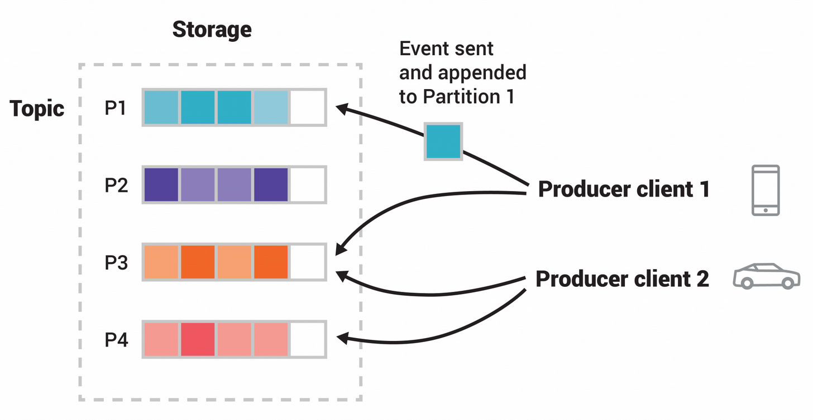

# Kafka

> 참고: [Apache Kafka Design](https://kafka.apache.org/43/design/design/)

## What is Apache Kafka?

이벤트 처리가 필요하다. 이벤트는 시간적 지표를 나타내는데, 매번 데이터베이스에 저장하는 것은 번거롭다.

그래서 로그라는 구조를 사용한다. 이벤트가 발생하면 정보, 설명, 결과를 담아 기록하며, 이 방식은 대규모 생산에도 유리하다. 이 문제를 Kafka는 **topic**으로 해결한다.

토픽은 사건들이 순서대로 보관된 것으로, 디스크에 저장된다. 이는 여러 디스크, 여러 서버에 복제되고 보관되어 하드웨어 결함이 발생하지 않도록 하며, 몇 시간이나 짧은 시간 동안 데이터를 보관할 수 있다. 토픽은 작을 수도, 클 수도 있다.

이벤트를 먼저 생각하고 데이터베이스를 나중에 생각하는 방식을 권장한다.

요즘엔 모놀리식에서 MSA로 넘어가면서, Kafka 토픽을 통해 서비스 간 소통이 가능해졌다. 각 서비스는 카프카 토픽에서 메시지를 소비할 수 있는 persistent real-time system이다. 즉각적으로 데이터 분석을 하고 싶을 때 Kafka를 사용하면 실시간으로 분석할 수 있어 간단하다.

Kafka는 세 가지 핵심 기능을 결합하여, 이벤트 스트리밍을 전 과정에서 구현할 수 있는 단일하고 검증된 솔루션을 제공한다.

1. **publish**(write)와 **subscribe**(read) — 자신의 데이터를 다른 시스템에서 지속적으로 가져오고 내보내는 등 다양한 이벤트 스트림을 게시하고 구독(읽기)하는 기능
2. **store** — 장기간에 걸쳐 이벤트 스트림을 안정적으로 보관하고 저장할 수 있도록 함
3. **process** — 실시간 또는 과거 데이터 스트림을 처리하는 기능

**Producer**: 카프카에 이벤트를 게시하는 클라이언트 애플리케이션
**Consumer**: 이런 이벤트를 구독하는 애플리케이션

카프카는 producer, consumer를 완전히 분리해서 서로 영향을 주지 않는 것이 고성능 확장성을 가능하게 하는 핵심 설계 요소다. 카프카는 exactly-once 이벤트 처리를 보장한다.

topic은 파일 시스템의 폴더와 유사하고, 이벤트가 해당 폴더의 파일과 같다. 카프카는 이벤트를 영구적으로 보장할 수 있으며, 카프카의 성능은 데이터의 크기에 관계없이 효과적으로 일정한 상태를 유지한다.

## 저장 구조

카프카는 메시지를 메모리가 아닌 디스크에 로그 형태로 저장한다.

- **Append-only Log**: 메시지를 덮어쓰지 않고 뒤에만 추가
- **retention 정책**: 시간 또는 용량 기반으로 보존 기간 설정 가능
- **Replication**: 파티션을 여러 브로커에 복제 → 일부 서버가 죽어도 데이터 유실 없음
- **Compaction**: 같은 key의 최신 값만 유지하는 옵션 → 영구 보존 가능

**Sequential access**: 로그 끝에 append하고 offset으로 순차 read하기 때문에, 데이터가 많아도 속도는 일정하다 — O(1).

### 파일 시스템 + 페이지 캐시

실제로 순차적 디스크 액세스가 특정 경우에는 무작위 메모리 액세스보다 더 빠르다는 것이 알려져 있다. Kafka는 JVM 위에 구축되지만, 메모리만이 답은 아니다 — 파일 시스템 + 페이지 캐시를 사용하는 것이 메모리 기반 캐시보다 우수하다.

모든 데이터를 파일 시스템의 영구 로그에 즉시 기록하며, OS가 디스크 I/O를 줄이기 위해 **메모리(RAM)를 디스크 데이터의 캐시로 활용**하는 메커니즘(페이지 캐시)을 그대로 활용한다.

```
디스크에서 파일 읽을 때

최초 읽기:
  App → OS Kernel → 디스크 읽기 → RAM(Page Cache)에 저장 → App 전달

두 번째 읽기:
  App → OS Kernel → RAM(Page Cache) 에서 바로! → App 전달
                    ↑ 디스크 안 감 (훨씬 빠름)

RAM
┌─────────────────────────────────┐
│  JVM Heap (애플리케이션 메모리)  │  ← 개발자가 관리 (GC 대상)
├─────────────────────────────────┤
│  Page Cache (OS 관리)           │  ← OS가 자동으로 관리
│  - 최근 읽은 파일 데이터         │
│  - 최근 쓴 파일 데이터           │
├─────────────────────────────────┤
│  기타 OS 영역                   │
└─────────────────────────────────┘
```

디스크에서는 log N 연산도 비싸기 때문에, 추가만 되는 지속적 큐 구조로 O(1)을 달성한다.

## Topic과 Partition

### 기본 정의

```
Topic = 데이터를 분류하는 카테고리
Partition = 그 Topic을 물리적으로 나눈 단위
```

```
Topic: order-events
┌──────────────────────────────────────┐
│ Partition 0: [0] → [1] → [2] → [3]  │
│ Partition 1: [0] → [1] → [2]        │
│ Partition 2: [0] → [1] → [2] → [3]  │
└──────────────────────────────────────┘
```

각 파티션은 **독립적인 로그 파일**이다.

Topic은 브로커에 파티셔닝된다 — 하나의 토픽이 여러 카프카 브로커에 분산되어 저장된다.



이렇게 하면 클라이언트가 동시에 여러 브로커에서 데이터를 읽고 쓰는 것이 가능하다. 동일한 이벤트 키를 가진 이벤트는 동일한 파티션에 기록되며, 카프카는 특정 토픽-파티션의 소비자가 해당 이벤트가 작성된 순서대로 읽기를 보장한다 (순서 보장).

### 파티션이 존재하는 이유

**파티션 없이 Topic 하나만 있다면?**

```
Producer1 ─┐
Producer2 ─┼──▶ [Topic] ──▶ Consumer (한 명이 다 처리)
Producer3 ─┘
```

병목 발생, 처리량 한계.

**파티션으로 나누면?**

```
Producer1 ──▶ Partition 0 ──▶ Consumer1
Producer2 ──▶ Partition 1 ──▶ Consumer2
Producer3 ──▶ Partition 2 ──▶ Consumer3
```

병렬 처리가 가능해진다. **파티션 수 = 최대 병렬처리 수**.

### 메시지가 어느 파티션으로 가는가

```
Producer가 메시지 보낼 때 결정됨

1. Key 있을 때  → hash(Key) % 파티션 수
   "userId=123" → 항상 같은 파티션으로
   (순서 보장 필요할 때 사용)

2. Key 없을 때  → Round-robin
   P0 → P1 → P2 → P0 → ...
   (균등 분배)

3. 커스텀       → 직접 로직 구현 가능
```

고객은 어떤 파티션에 메시지를 게시할지 제어할 수 있다 — 무작위 로드밸런싱 또는 의미론적 파티션 기능을 선택할 수 있다. 의미론적 파티션 인터페이스에서는 사용자가 파티션을 구분할 키를 지정하고, 이를 해싱해서 파티션을 결정한다.

Producer는 중간 서버를 거치지 않고 해당 파티션의 리더 서버에 직접 데이터를 전송한다. Producer는 Kafka 노드로부터 특정 토픽의 파티션 리더 서버가 현재 어떤 서버인지에 대한 메타데이터를 받아 적절한 방식으로 요청을 전달할 수 있다.

### 순서 보장

```
파티션 내부  → 순서 보장 ✅  (offset 순서대로)
파티션 간    → 순서 보장 ❌

P0: [주문생성] → [결제완료] → [배송시작]  ← 이 순서는 보장
P1: [주문생성] → [결제완료]
       ↑ P0랑 P1 간의 순서는 보장 안 됨
```

그래서 **순서가 중요한 데이터는 같은 Key로 묶어서** 같은 파티션으로 보낸다.

```java
// 같은 userId는 항상 같은 파티션으로
producer.send(new ProducerRecord<>("order-events", userId, message));
//                                                  ↑ Key
```

### 파티션과 브로커의 관계

```
Kafka Cluster (Broker 3대)

Broker1        Broker2        Broker3
┌──────────┐  ┌──────────┐  ┌──────────┐
│ P0(Lead) │  │ P1(Lead) │  │ P2(Lead) │
│ P1(복제) │  │ P2(복제) │  │ P0(복제) │
└──────────┘  └──────────┘  └──────────┘
```

- 파티션은 여러 브로커에 **분산 + 복제**
- Leader가 읽기/쓰기 담당, Follower는 복제만
- Broker 죽으면 Follower가 Leader로 승격

### 실무에서 파티션 수 결정

```
파티션 늘리기  → 가능 ✅ (언제든)
파티션 줄이기  → 불가능 ❌ (Topic 재생성해야 함)
```

그래서 처음 설계할 때 파티션 수가 중요하다.

```
기준: max(예상 처리량(MB/s) ÷ 10, 예상 컨슈머 수)

예) 컨슈머 최대 5개 쓸 거면 → 파티션 5개로 시작
```

## Offset

- 토픽에서 특정 파티션 내에서 특정 이벤트의 위치
- 토픽은 선형적으로 추가되며, 토픽은 파티션으로 나뉜다
- 오프셋은 64비트 정수로 표현되며, 증가하는 순서대로 기록된다
- 오프셋은 파티션 내에서만 유일하고 독립적이다

```
Topic: order-events

Partition 0: [0] → [1] → [2] → [3] → [4]
Partition 1: [0] → [1] → [2]
Partition 2: [0] → [1] → [2] → [3]
```

## Consumer와 Consumer Group

컨슈머 그룹은 서로 완전히 독립적이다.
→ 그룹 간에는 파티션을 나눠 갖지 않는다.
→ 각 그룹이 파티션 전체를 독립적으로 소비한다.

컨슈머는 소비하고자 하는 파티션을 담당하는 브로커에 "fetch" 요청을 보내는 방식으로 동작한다.

### Push vs Pull

데이터는 생산자로부터 브로커로 전달되고, 소비자에 의해 브로커로부터 가져와진다 — Kafka는 pull 모델을 쓴다.

Push 기반 시스템은 브로커가 데이터 전송 속도를 제어하기 때문에 다양한 소비자를 처리하기 어렵다.

```
Push 모델 (브로커가 밀어넣음)
  Broker ──▶ Consumer
  "내가 줄게!"

Pull 모델 (컨슈머가 당겨옴)
  Broker ◀── Consumer
  "나 줄 거 있어?"
```

**pull 모델 장점**
- 컨슈머가 자기 속도에 맞춰 소비
- 소비자에 전달되는 데이터를 효율적으로 묶을 수 있다

**단점**
- 줄 메시지가 없는데도 컨슈머가 계속 물어볼 수 있음 → 롱폴링으로 해결 (클라이언트는 데이터를 받을 때까지 대기)

### 실무 포인트

- **파티션 수 = 최대 병렬 처리 수** (컨슈머 늘려도 파티션 이상 못 늘림)
- **처리량 높이려면** 파티션 수를 먼저 늘려야 함
- **그룹 2개** 쓰는 이유 → 같은 데이터를 다른 용도로 동시에 소비할 때
  - 그룹 ID = "어떤 목적으로 읽는 집단인가"를 구분하는 논리적 식별자

## Rebalancing

카프카 컨슈머 그룹이 특정 토픽에 대해 구독하고 있을 때, 컨슈머가 추가되거나 나갈 때마다 그 그룹의 모든 구성원에게 공정하게 파티션을 다시 할당하는 과정이 리밸런싱이다.

```
Rebalancing 트리거:
  컨슈머 추가 / 이탈 / 장애 / 파티션 수 변경

주의할 점:
  Rebalancing 중 전체 그룹 일시 정지
  → 자주 일어나면 Lag 쌓임
  → max.poll.interval.ms 튜닝 필요
```

### Consumer Position

대부분의 메시징 시스템은 브로커에서 어떤 메시지가 소비되었는지에 대한 메타데이터를 보관한다. 이 상태를 어디에 보관할지가 관건인데, 보통 브로커가 소비된 내용을 알면 즉시 삭제하여 데이터 크기를 줄인다.

브로커와 소비자 간에 어떤 메시지가 소비되었는지 합의하는 것은 간단한 문제가 아니다. 브로커가 메시지를 네트워크를 통해 전달할 때마다 즉시 소비된 것으로 기록한다면, 소비자가 메시지를 처리하지 못하는 경우 메시지가 사라질 수 있다. 그래서 보통 ack를 추가해서 소비자의 확인을 기다린다. 여기엔 두 가지 문제가 있다.

- 소비자가 메시지를 처리했지만 확인 전에 실패하면 메시지가 두 번 소비될 수 있다
- 성능 측면에서 브로커는 여러 상태를 유지해야 한다 (모든 메시지에 대해 재전송 방지, 삭제 처리 등)

**카프카의 처리 방식**

- topic은 순서대로 정렬된 파티션으로 구성된다
- 각 파티션은 특정 구독 그룹 내에서 정확히 하나의 소비자만 소비한다
- 각 파티션 내에서 소비자의 위치는 하나의 정수 — 다음 메시지의 소비 위치를 나타낸다

### Static Membership

정적 멤버십은 그룹 재균형 프로토콜을 기반으로 구축된 스트림 애플리케이션, 소비자 그룹 및 기타 애플리케이션의 가용성을 향상시키는 것을 목표로 한다.

이 프로토콜은 그룹 코디네이터가 그룹 멤버에게 엔티티 ID를 할당하는 데 의존한다. 기존 방식(동적 멤버십)에서 생성된 ID는 일시적이며 멤버가 재시작하거나 재가입할 때 변경된다. 소비자 기반 애플리케이션의 경우, 이런 "동적 멤버십"은 코드 배포, 구성 업데이트, 주기적 재시작 같은 관리 작업 중에 많은 양의 작업이 다른 인스턴스로 재할당될 수 있다. 대규모 상태 애플리케이션의 경우 작업이 처리되기 전에 로컬 상태를 복구하는 데 시간이 오래 걸리므로 애플리케이션이 부분적으로 또는 완전히 사용할 수 없게 된다.

이런 관찰에 기반해, Kafka의 그룹 관리 프로토콜은 그룹 멤버에게 영구적인 엔티티 ID를 제공할 수 있도록 한다. 이런 ID를 기반으로 하면 그룹 멤버십이 변경되지 않으므로 재균형이 발생하지 않는다.

## 메시지 전달 규칙 (Delivery Semantics)

메시지 전달 보증에는 세 가지가 있다.

- at most once
- at least once
- exactly once

이 문제는 메시지 게시에 대한 보증과 메시지 소비에 대한 보증, 두 가지 측면으로 나눌 수 있다.

많은 시스템에서 "정확히 한 번" 전달 메커니즘을 제공한다고 주장하지만, 세부 사항을 주의 깊게 확인하는 것이 중요하다. 소비자와 생산자가 실패하는 경우, 여러 소비자가 동시에 작업을 수행하는 경우, 디스크에 기록된 데이터가 손실될 수 있는 경우 등에서 이런 주장이 항상 정확하지는 않을 수 있기 때문이다.

### 카프카에서의 처리

**게시(publish) 측면**

- 메시지가 게시되면 로그에 저장된다 — 해당 파티션의 동기화된 복제본에 있는 모든 복제본이 그 메시지를 자신의 로그에 적용했다는 뜻이다
- 한 번 메시지가 게시되면, 해당 메시지가 기록된 파티션을 복제하는 브로커 중 하나라도 "활성" 상태로 유지되면 메시지가 손실되지 않는다
- 0.11 버전 이후부터 Kafka producer는 중복된 항목이 로그에 기록되지 않도록 보장하는 멱등성(idempotent) 전달 옵션을 제공한다
- 각 생산자에게 id를 할당하고, producer는 메시지와 함께 보낸 시퀀스 번호를 사용해 메시지 중복을 제거한다
- 트랜잭션을 사용해서 여러 토픽 파티션에 메시지를 원자적으로 전송할 수도 있다

**소비(consume) 측면**

모든 복제본은 동일한 로그와 동일한 오프셋을 가지고 있으므로, 소비자는 이 로그 내에서의 위치를 스스로 제어한다. 소비자가 메시지를 읽고, 처리하고, position을 업데이트하는 순서에 따라 보증 수준이 갈린다.

1. **메시지 읽고 위치 저장 후 처리**
   - 처리 후 위치 저장 전에 소비자 프로세스가 충돌할 가능성이 있음
   - 소비자 프로세스 실패 시 메시지가 처리되지 않을 수 있음
2. **메시지 읽고 처리하고 위치 저장**
   - 처리 중, 저장하기 전에 소비자 프로세스가 충돌할 수 있음
   - 새로운 프로세스가 수신하는 메시지는 이미 처리된 상태일 수 있음
   - → at least once 의미와 일치

**그럼 exactly-once는 어떻게 달성하는가**

0.11 버전의 트랜잭션 프로듀서 기능을 활용한다. 소비자의 위치는 내부 토픽에 메시지로 처리되므로, 처리된 데이터를 받는 출력 토픽에 쓰는 것과 Kafka에 오프셋을 쓰는 것을 동일한 트랜잭션에서 수행할 수 있다. offset은 `__consumer_offsets`라는 내부 토픽에 저장되며, 즉 offset commit 자체가 Kafka 토픽에 메시지를 쓰는 행위다.

```
트랜잭션 시작
  ├── output 토픽에 결과 write
  └── offset commit
트랜잭션 커밋 (둘 다 성공) ✅
또는
트랜잭션 롤백 (둘 다 실패) ✅

절대로:
  결과만 write되고 offset은 안 되는 상황 ❌
  offset만 되고 결과는 안 되는 상황 ❌
```

외부 시스템이 2PC(2-phase commit)를 지원하지 않으면, offset을 결과와 같은 곳에 함께 저장하는 방식으로 우회할 수 있다. 재시작해도 offset을 보고 이어서 처리하면 되므로 중복이나 유실이 없다.

```
2PC 대신:
offset을 외부 시스템에 결과랑 같이 저장해버림

┌─────────────────────────────────┐
│         HDFS                    │
│  결과 데이터: {주문정보...}      │
│  offset 정보: {partition:0,     │
│               offset: 42}  ← 같이 저장
└─────────────────────────────────┘
```

Producer와 Consumer를 사용한 exactly-once 처리에는 세 가지 핵심 요소가 있으며, 이는 Kafka Streams가 동작하는 방식과도 일치한다.

1. 소비자는 파티션 할당을 통해, 현재 처리 중인 파티션에 대해 해당 그룹 내에서 유일한 소비자가 되도록 보장한다.
2. 생산자는 트랜잭션을 사용해서, 자신이 생성하는 모든 레코드와 소비자를 대신해 업데이트하는 모든 오프셋을 원자적으로 처리한다.
3. 트랜잭션을 재균형과 함께 제대로 처리하려면, 각 소비자 인스턴스마다 하나의 생산자 인스턴스를 사용하는 것이 좋다. 더 복잡하고 효율적인 방법도 가능하지만 그만큼 복잡성이 증가한다.

## Share Consumer

Kafka에서 데이터를 소비하는 것은 주로 소비 그룹의 소비자가 수행한다. 소비 그룹이 그룹 구성원에게 파티션을 할당하는 방식은 순서와 확장성을 함께 제공하는 강력한 조합이다. 그러나 일부 전통적인 메시징 워크로드는 소비 그룹 모델에 적합하지 않다.

공유 그룹(share group)은 전통적인 소비자 그룹과 함께 존재하는 또 다른 유형의 그룹이다. 특히 파티션과 기록에 대한 세분화된 공유가 필요한 경우, 소비자 그룹의 대안으로 활용될 수 있다. 공유 그룹은 소비자들이 협력해서 주제에 대한 기록을 소비하고 처리할 수 있게 한다. 공유 그룹 내의 소비자는 "공유 소비자"라고 불리며, 익숙하지만 다른 프로그래밍 인터페이스를 사용한다.

**share group의 특징**

- 그룹의 구성원들은 함께 기록을 소비하며, 여러 구성원에게 파티션을 할당할 수 있다
- 특정 토픽에 참여하는 컨슈머 수가 파티션의 수를 넘을 수 있다
- 개별 기록은 확인되지만, 시스템은 효율성을 높이기 위해 대량 처리를 최적화하도록 설계되어 있다
- share group 내 컨슈머에게 전달을 시도한 횟수를 기록해, 처리 불가능한 기록에 대한 자동 처리가 가능하다

## Replication

구성 가능한 서버 수에 따라 각 토픽의 파티션을 복제한다 → 클러스터 서버 중 하나에 오류가 발생해도 메시지를 계속 사용 가능하게 전환 처리한다.

복제 단위는 파티션이다. 각 파티션은 단일 리더와 0개 이상의 팔로워를 가진다. 리더를 포함한 전체 복제 수는 복제 인수(replication factor)를 나타낸다. 모든 쓰기는 파티션의 리더로 전송되며, 읽기는 파티션의 리더 또는 팔로워를 통해 수행할 수 있다. 일반적으로 파티션의 수가 브로커 수보다 훨씬 많으며, 리더는 브로커에 균등하게 분배된다. 팔로워의 로그는 리더의 로그와 동일하며, 동일한 오프셋과 순서의 메시지를 포함한다(다만 특정 시점에는 리더의 로그 끝에 아직 복제되지 않은 메시지가 있을 수 있다).

팔로워는 리더로부터 메시지를 일반적인 Kafka 소비자처럼 받아 자신의 로그에 적용한다. 팔로워가 리더로부터 데이터를 가져오는 방식은 팔로워가 자신의 로그에 적용할 로그 항목을 자연스럽게 그룹화하는 이점을 제공한다.

대부분의 분산 시스템과 마찬가지로, 자동으로 오류를 처리하려면 노드가 "활성" 상태인 것을 정확하게 정의해야 한다. Kafka에는 클러스터 내 브로커의 등록 관리를 담당하는 특별한 노드인 "컨트롤러"가 있다. 브로커가 활성 상태이려면 다음 두 조건을 만족해야 한다.

1. 브로커는 정기적인 메타데이터 업데이트를 받기 위해 컨트롤러와의 활성 연결을 유지해야 한다.
2. 팔로워 역할을 하는 브로커는 리더의 쓰기를 정확하게 복제하고, 너무 많이 뒤처지지 않아야 한다.

물론 리더가 실패하지 않으면 팔로워가 필요하지 않다. 리더가 사망하면 팔로워 중에서 새로운 리더를 선택해야 한다. 하지만 팔로워 자체도 뒤처지거나 실패할 수 있으므로, 항상 최신 팔로워를 선택해야 한다. 로그 복제 알고리즘이 제공해야 하는 기본적인 보장은, 클라이언트에게 메시지가 커밋되었다는 정보를 전달했다면 리더가 실패했을 때 새로 선택된 리더도 그 메시지를 가지고 있어야 한다는 것이다. 이는 다음과 같은 절충점을 의미한다 — 리더가 메시지를 커밋하기 전에 더 많은 팔로워가 메시지를 확인하도록 기다리면, 더 많은 잠재적인 리더를 선택할 수 있게 된다.

필요한 확인(acknowledgement) 수와, 리더를 선출하기 위해 비교해야 하는 로그 수를 선택할 때 반드시 중복이 발생하도록 설계하면, 이를 **쿼럼(Quorum)**이라 부른다.

이런 상충 관계에 대한 일반적인 접근 방식은 커밋 결정과 리더 선출 모두에 대해 다수 투표를 사용하는 것이다. 예를 들어 2f+1개의 복제본이 있다고 가정해보자. 리더가 커밋을 선언하기 전에 f+1개의 복제본이 메시지를 수신해야 한다고 하고, f+1개의 복제본 중 가장 완전한 로그를 가진 팔로워를 새 리더로 선출한다고 하면, 최대 f번의 오류가 발생하더라도 리더는 모든 커밋된 메시지를 보유하게 된다. f+1개의 복제본 중에는 반드시 최소 하나의 복제본이 모든 커밋된 메시지를 포함하고 있기 때문이다. 그 복제본의 로그가 가장 완전하므로 새로운 리더로 선택된다.

다만 각 알고리즘이 처리해야 할 세부 사항은 더 많다 (예: 로그가 얼마나 완전한지를 정확히 정의하는 문제, 리더 실패 시 로그 일관성을 유지하는 문제, 복제 세트의 서버 변경 등).
